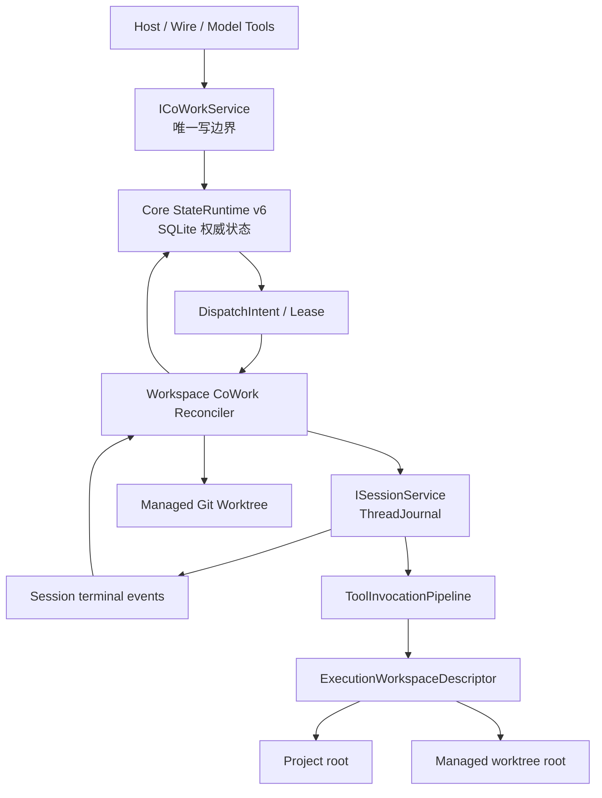

# OpenCoWork M7 Multi-Agent CoWork 详细设计

## 文档状态

- 状态：设计已冻结，正在实施；Outcome 1-3 已完成
- 日期：2026-07-30
- 所属里程碑：OpenCoWork Runtime 1.0 / M7
- 已确认决策：27 项
- 对应计划：
  [M7 Multi-Agent CoWork 实施计划](../plans/2026-07-30-open-cowork-m7-multi-agent-cowork-implementation-plan.md)
- 对应归档：尚未实施
- 继续工作前必须先阅读：
  - [OpenCoWork Runtime 1.0 路线规格](2026-07-25-open-cowork-runtime-1-0-roadmap.md)
  - [M0 Contract Freeze](2026-07-25-open-cowork-m0-contract-freeze-design.md)
  - [M0 能力台账](2026-07-25-open-cowork-m0-capability-ledger.md)
  - [M0-M10 验收目录](2026-07-25-open-cowork-m0-acceptance-catalog.md)
  - [M2 Durable Session Core 设计](2026-07-26-open-cowork-m2-durable-session-core-design.md)
  - [M3 Agent Runtime Alpha 设计](2026-07-27-open-cowork-m3-agent-runtime-alpha-design.md)
  - [M4 Tool Runtime Alpha 设计](2026-07-28-open-cowork-m4-tool-runtime-alpha-design.md)
  - [M5 Wire Alpha 设计](2026-07-28-open-cowork-m5-wire-alpha-design.md)
  - [M6 Capability Ecosystem 设计](2026-07-29-open-cowork-m6-capability-ecosystem-design.md)
  - `DotCraft_Core_核心代码详细设计与一比一复刻规范_v1.0.md`

本文冻结 M7 的产品边界、权威关系、状态机、持久化模型、安全顺序、Wire 1.2
契约和验收边界。本文不是实施计划，不拆实现 Outcome，也不授权开始编码。

## 1. 目标、范围与不变量

M7 在现有 Durable Session、Agent Runtime、Tool Runtime、Wire 和 Capability
Ecosystem 上增加可恢复的多 Agent 协作能力：

- 直接 SubAgent 父子协作；
- Agent Profile、Team、Member 和 Mission；
- MissionTask DAG、Review 和 Rework；
- 持久 Mailbox；
- 私有 Scratchpad 与不可变 Artifact；
- Project 与 Git Worktree 执行空间；
- Token 预算、深度、并发和成员互斥；
- Leader 综合与 Origin 单次回传；
- OpenCoWork Wire 1.2。

M7 必须保持以下不变量：

1. `SessionService` 与 `ThreadJournal` 仍是 Thread、Turn 和模型历史的唯一权威源；
2. `ToolInvocationPipeline` 仍是模型工具副作用的唯一入口；
3. M6 Capability Catalog 继续按 Turn 冻结，不允许 Mission 修改正在执行的
   Effective Tool/Skill Snapshot；
4. SQLite 是 CoWork 编排状态的唯一权威源，内存队列只负责唤醒；
5. Wire、Host 和模型工具共用同一个 `ICoWorkService` 写边界；
6. 直接 SubAgent 与 Mission 共用执行底座，但直接 SubAgent 不创建隐藏 Mission；
7. M0 冻结的七个 Wire 公共域保持不变：
   `agent`、`subagent`、`team`、`mission`、`mailbox`、`artifact`、`worktree`；
8. OpenCoWork 不读取或兼容 DotCraft 的 `.craft`、程序集或私有实现。

不包含：

- M8 的周期自动化、Cron、无人值守调度；
- M9 的外部渠道、Gateway 和远程 Agent；
- 外部 CLI Agent、自定义进程 Agent 或远程执行器；
- 自动 Commit、Merge、Rebase、Cherry-pick 或 Patch 应用；
- 通用 RBAC、自定义权限表达式或热更新 Mission 成员；
- ACP 扩展或服务端主动请求；
- 新 Provider 兼容性声明。

## 2. 权威架构



职责边界：

| 组件 | 职责 | 明确不负责 |
| --- | --- | --- |
| `OpenCoWork.Teams` | CoWork 领域规则、`ICoWorkService`、Reconciler、工具定义、v6 迁移片段 | 自建数据库、替代 Session、绕过工具管线 |
| Core `StateRuntime` | SQLite 连接、事务、备份、迁移、完整性校验、写串行化 | Mission 调度策略 |
| `ISessionService` | Leader、Member、SubAgent Thread 与 Turn 的持久执行 | Team/Mission 权威状态 |
| `ToolInvocationPipeline` | Tool Authority、Policy、Approval、Hook、Binding Lease、审计 | 从全局工作区猜测调用者根目录 |
| Wire Adapter | 参数校验、版本投影、事件转发 | 第二套状态机或后台调度 |

`OpenCoWork.Teams` 是非 Primary 模块，不依赖 `OpenCoWork.Core`；它只使用
`OpenCoWork.Abstractions` 稳定契约和 M0 允许的 Protocol 扩展点。它通过
`IWorkspaceStateMigrationContributor` 声明 v6 迁移片段，通过只暴露标准
`DbConnection` / `DbTransaction` 回调的 `IWorkspaceStateStore` 使用 Core 状态库；
程序集不得直接引用 `Microsoft.Data.Sqlite`，也不增加 Repository 或 Unit of Work
层。

每个 Workspace 只运行一个 Reconciler。多进程、分布式 Leader Election 和跨主机
调度不属于 M7。

## 3. 领域模型与冻结时点

### 3.1 AgentProfile

AgentProfile 是可复用的执行配置，包含：

- 稳定 ID、名称、说明；
- Instructions；
- Provider 与 Model；
- Skill Allowlist；
- Tool Allowlist；
- Enabled、Revision 和时间戳。

Allowlist 只能缩小 M6 提供的有效目录，不能增加未授信能力。Profile 不允许保存环境
变量、Secret、命令参数或其他凭据。禁用已被 Mission 引用的 Profile 只影响新执行，
不得破坏历史快照。

### 3.2 Team 与 Member

Team 包含名称、说明、一个 Leader 和至多 15 个普通 Member，总成员上限 16。
Member 包含：

- Mission 内唯一 Alias；
- AgentProfile 引用；
- `Leader` 或 `Member` 角色；
- 面向 Leader 的职责说明。

Member 不提供 Provider、Model、Prompt、Tool 或 Skill 覆盖层；差异必须通过独立
AgentProfile 表达。Team 的 Upsert 必须原子校验唯一名称、唯一 Alias、恰好一个
Leader、Profile 可解析且已启用。

### 3.3 Mission 冻结

`CreateMission` 只接收：

- Objective；
- Team ID；
- 正数 TokenBudget；
- `Project` 或 `Worktree` 执行模式；
- Worktree 模式下可选的 `allowDirtyOrigin`。

创建后 Mission 处于 `Planning`，Leader 负责产生初始 DAG。`Activate` 成功时一次性
冻结：

- Team Revision；
- Member/Alias/Role/Description；
- Profile 内容、Provider、Model、Instructions 和 Allowlist；
- Workspace 模式；
- Git Base Commit SHA；
- 根 BudgetScope。

Create 事务同时记录 `PlanningTeamRevision` 并创建 Leader Planning Intent。
Reconciler 使用当时的 Leader Profile Snapshot 启动第一个 Leader AgentRun。若
Planning 期间 Team 或任一引用 Profile 的 Revision 变化，`Activate` 返回冲突；
Host 必须取消后创建新 Mission，不能把旧计划静默套到新团队定义上。

后续 Profile 或 Team 修改只影响新 Mission。Active Mission 不允许增删成员；未运行
Task 可以在已冻结成员之间重新指派。

### 3.4 MissionTask

MissionTask 包含：

- Mission 内唯一 Alias；
- Objective / Instructions；
- Assigned Member；
- `Required`，默认 `true`；
- `RequiresReview`，Required 默认 `true`、Optional 默认 `false`，允许显式覆盖；
- `DependsOn`；
- 状态、阻塞原因、当前 Attempt、OutputSummary 和 Artifact 引用；
- Revision 与时间戳。

依赖只引用同一 Mission 的 Task Alias。Task 总数上限 256。

### 3.5 AgentRun

AgentRun 是一次实际 Agent 执行：

- Direct SubAgent 或 Mission Task；
- 不可变 Profile Snapshot；
- Parent Run / Parent Thread 或 Mission/Task/Member；
- 独立 Session Thread；
- 独立 `ExecutionWorkspaceDescriptor`；
- 从 Effective Tool Snapshot 保守推导的 `ReadOnly` / `ReadWrite` Workspace Access；
- Attempt；
- Token 预留、结算与错误；
- Lease 和生命周期状态。

Task 重试必须创建新的 AgentRun 和递增 Attempt，不能复活旧 Run。Leader、Member
和直接 SubAgent 均使用当前内置 AgentRuntime，不引入第二套 Agent 执行器。

每个 Mission 只有一个持久 Leader Thread，用于 Planning、Review 和 Synthesis；这些
模型调用仍分别登记 AgentRun，并消耗 Mission 根预算与并发。Leader 只拥有编排工具，
其执行空间固定为 Project Root。每个 Member Task Attempt 创建新的 Member Thread，
因此 Worktree 模式可以严格保持“一次 AgentRun、一个 Thread、一个 Worktree”；重试
不复用旧 Thread 或旧 Worktree。

### 3.6 Thread 与执行空间绑定

每个 Leader、Member 和 SubAgent Thread 创建时必须绑定一个不可变
`ExecutionWorkspaceDescriptor`：

```text
Project:
  workspaceRoot
  scratchpadRoot

Worktree:
  workspaceRoot
  worktreeId
  worktreeRoot
  baseCommitSha
  scratchpadRoot
```

File、Shell、SourceControl 和 Terminal 工具必须从调用者 Thread 绑定解析根目录，
不得再默认使用 Workspace 全局根。Wire `thread/create` 不允许客户端提供任意路径；
只有 CoWork 内部命令可以创建 Managed Worktree Thread。ThreadJournal 保存路由绑定，
Teams SQLite 保存生命周期；两者不一致时失败关闭。

AgentRuntime 读取 Workspace Instructions 时同样使用该 Thread 的 Project/Worktree
Root，不使用进程级 `OpenCoWorkPaths.WorkspaceRoot`。M6 Capability Catalog 仍属于
Origin Workspace；执行根只缩小路径和 Trust，不能发现或激活额外能力。

## 4. 状态机

### 4.1 Mission

```text
Planning
  -> Active

Active
  -> AwaitingLeaderReview
  -> Failed
  -> Cancelled

AwaitingLeaderReview
  -> Active       (Review / Rework 产生后续执行)
  -> Completed    (综合结果已持久化)
  -> Failed
  -> Cancelled
```

- Mission 没有 `Blocked` 或 `Paused`；
- 单个 Task 失败不自动把 Mission 标记为 Failed；
- 所有 Required Task 已完成、没有 `Review` 或 `Blocked` 后，Mission 才进入
  `AwaitingLeaderReview`；
- Required Task 失败或取消会阻止综合，Leader 必须选择重试、替换、取消或在规则允许
  时调整后续 DAG；
- Optional Task 失败不会阻止综合，但必须进入 Leader 输入和最终摘要；
- `Completed` 表示 Leader 综合已持久化，不表示 Origin 已完成回传；
- `Failed` 只用于不可恢复错误或 Leader/Host 的显式终止决定。

### 4.2 MissionTask

```text
Pending -> WaitingDependencies -> Ready -> Running
                         Ready -> Blocked
                       Running -> Blocked
                       Running -> Review -> Completed
                       Running -----------> Completed
                       Running -----------> Failed

Blocked -> Ready
Review  -> Ready       (Rework，新 AgentRun)
Failed  -> Ready       (Retry，新 AgentRun)
非终态  -> Cancelled
```

Active 后已有依赖边不可修改或删除。Leader 可以：

- 追加 Rework Task；
- 重试 Failed Task；
- 重新指派非 Running Task；
- 接受或退回 Review；
- 豁免 Failed Optional Task；
- 显式 Block / Unblock。

对同一工作目标的返工使用原 Task 新 Attempt；独立新增工作使用新的 Rework Task。

### 4.3 其他实体

| 实体 | 状态 |
| --- | --- |
| AgentRun | `Pending -> Starting -> Running -> Completed / Failed / Cancelled` |
| MailboxMessage | `Pending -> Delivered -> Acknowledged`，失败耗尽后 `DeadLettered` |
| Worktree | `Creating -> Ready -> Removing -> Removed`；脏目录为 `RetainedDirty`；错误为 `Faulted` |
| Artifact | `Available -> Unavailable` |
| DispatchIntent | `Pending -> Leased -> Completed`，失败耗尽后 `DeadLettered` |

AgentRun 不复制 Session 的等待、流式或 Turn 状态。Worktree 的 `RetainedDirty` 不是错误
恢复中的临时状态，必须等待 Host 明确处理。

## 5. 命令、Revision 与幂等

`ICoWorkService` 是所有写入的唯一入口。每个变更命令必须携带：

- 由可信适配层构造的 Actor Context：Host 使用已认证的本地 Host/Wire Principal，
  模型调用使用 Caller Thread 的持久绑定；
- `commandId`；
- 目标实体 ID；
- `expectedRevision`，创建命令除外；
- 命令负载。

一次 SQLite 事务内完成：

1. 校验 Actor、权限、状态和 Revision；
2. 写入实体变更；
3. 写入必要的 DispatchIntent；
4. 单调递增 `coWorkRevision`；
5. 保存 `cowork_command_receipts`。

事务提交后才执行 Session、Git 和文件系统副作用。相同 `commandId` 重放必须返回原
结果，不重复创建 Thread、Turn、Worktree、Artifact 或通知。未知结果先按
`commandId` / `DispatchIntentId` 探测，再决定重放。

Revision 冲突返回稳定错误，不做静默 last-write-wins。Host、Wire、Leader 和模型工具
不得直接写 SQLite。

## 6. SQLite v6

M7 将 Workspace State Schema 从 v5 升到 v6。Core 必须先备份现有数据库，再在一个
全局迁移事务中组合并执行 Teams v6 片段，最后运行结构、外键和完整性校验；失败时不
启动 Teams 模块。

v6 新增 14 张表：

| 表 | 最小权威内容 |
| --- | --- |
| `cowork_state` | Workspace 单例 `coWorkRevision` 与更新时间 |
| `agent_profiles` | Profile 定义、Allowlist、Enabled、Revision |
| `teams` | Team 定义、Enabled、Revision |
| `team_members` | Team、Alias、Profile、Role、Description、顺序 |
| `missions` | Origin、Team、Planning Team Revision、Objective、状态、Workspace 模式、Base SHA、Budget、Leader Thread、综合与回传标识 |
| `mission_members` | Mission 激活时冻结的 Member 与 Profile Snapshot |
| `mission_tasks` | Alias、指派、Required、Review、`DependsOn` JSON、状态、摘要、Revision |
| `cowork_budget_scopes` | Owner、Token Limit、Reserved、Used |
| `agent_runs` | 执行种类、父子关系、Task/Member、Attempt、Thread、Workspace、Token、Lease、状态 |
| `mailbox_messages` | Mission/Direct Scope、Sender、Recipient、Type、正文、Task/Artifact 引用、状态、Attempt、Lease |
| `cowork_files` | Mission/Direct Owner、Scratchpad/Artifact、相对路径、摘要、大小、可见性、可用状态 |
| `cowork_worktrees` | Mission/Run、相对路径、Base SHA、状态、脏标记、诊断 |
| `cowork_dispatch_intents` | Side-effect 类型、实体、幂等键、状态、Attempt、Lease、诊断 |
| `cowork_command_receipts` | Command ID、Actor、命令类型、目标、结果、Revision |

约束：

- ID 使用 UUIDv7；调度排序使用 `CreatedAt + UUIDv7`；
- `agent_profiles.Name`、`teams.Name` 在 Workspace 内唯一；
- `team_members.Alias`、`mission_members.Alias` 和 `mission_tasks.Alias` 在各自父级唯一；
- Team 恰好一个 Leader；
- `mission_tasks.DependsOn` 使用规范化 JSON 数组，不增加依赖边表；
- 同一 Mission Member 同时最多一个 Active AgentRun，使用数据库部分唯一索引保证；
- Project 模式同时最多一个 `ReadWrite` AgentRun，使用数据库部分唯一索引保证；
- 同一 Task/Attempt、Worktree 相对路径、OriginDeliveryId 和 Dispatch 幂等键唯一；
- Artifact 只在 Mission 内按 SHA-256 去重，不建设全局 Blob Store；
- Profile/Team 被引用后只能禁用，不能物理删除；
- SQLite 不保存全量 Thread 历史、Secret、Artifact 内容或 Scratchpad 内容；
- 不增加 Digest 表、事件表、Revision 历史表、Outbox 表或 Repository/UoW。

M8/M9 必须复用同一个 Core 迁移机制，不得各自拥有第二个 Workspace 数据库。

## 7. Reconciler、Intent 与恢复

Reconciler 每轮按固定顺序处理：

1. 传播取消；
2. 恢复已终态 Session 对应的 AgentRun / Task；
3. 启动待处理的 Leader Planning；
4. 投递和重试 Mailbox / Direct Message；
5. 计算 DAG 并生成 Ready Task；
6. 获取成员、并发、预算与 Dispatch Lease；
7. 启动 AgentRun；
8. 触发 Leader Review / Synthesis；
9. 向 Origin 回传最终结果。

事务内只做状态计算、资源预留、Lease 和 Intent 批量写入；Session、Git 和文件系统调用
在事务外执行，再以相同幂等键写回。单次循环可以并行处理互不冲突的副作用，但必须让
SQLite 约束决定正确性。

唤醒来源：

- Workspace 启动；
- CoWork 写事务提交；
- Session 进入终态；
- Mailbox 提交或确认；
- Lease 到期或续约。

内存 `Channel` 仅合并唤醒，不保存任务。进程崩溃后，Reconciler 必须从 SQLite 与
Session Journal 恢复；过期 Lease 可被接管，未过期 Lease 不得并发重复执行。

DispatchIntent 最多尝试 5 次，Lease 为 2 分钟，每 30 秒续约。自动重试只覆盖瞬时
基础设施错误，使用无抖动、有限上限的简单指数退避。业务错误、权限错误、预算耗尽、
非法 DAG、安全拒绝和模型/工具失败均不自动创建新 AgentRun。

## 8. DAG、Review 与综合

### 8.1 Planning 与 Activate

Planning 阶段允许 Leader 增删 Task、修改依赖和指派。`Activate` 在一个事务中校验：

- Mission Revision 匹配；
- Team、Profile 和 Member 快照完整；
- Alias 唯一；
- Task 数量和成员数量未超限；
- Required、Review 和 Assignment 合法；
- 所有依赖存在且无环；
- TokenBudget 为正数；
- Workspace 模式与 Base Commit 有效。

任一校验失败时 Mission 保持 Planning，不产生部分 Thread、Worktree 或 AgentRun。

### 8.2 Ready 计算

Task 只有同时满足下列条件才进入 Ready：

- Mission 为 Active；
- Task 非终态、非 Blocked、非 Review；
- 所有 DependsOn Task 已 Completed；
- Assigned Member 可用；
- 没有已运行的同 Member AgentRun；
- 全局与 Mission 并发有容量；
- BudgetScope 能完成 Token 预留。

Ready 不等于已调度；Reconciler 仍需在同一事务内完成成员互斥、并发占位和 Token
预留。

### 8.3 Member 完成

Member AgentRun 完成时只向 CoWork 状态写入：

- `OutputSummary`；
- 终态；
- Artifact 引用；
- Provider Usage；
- 必要的诊断代码。

完整对话只保存在该 Member 的 ThreadJournal。若 `RequiresReview=false`，Task 直接
Completed；否则进入 Review，等待 Leader/Host 以 Revision 接受或返工。

### 8.4 Leader 综合

Leader 的综合输入按 Task 创建顺序确定性构造，只包含：

- 已完成 Required Task 的 OutputSummary；
- Optional Task 的完成摘要或失败说明；
- Artifact 元数据和可用状态；
- 未解决 Blocker / Review 摘要；
- Mission Objective 与冻结成员职责。

Leader 可以先 Review、请求 Rework 或新增后续 Task。只有所有 Required Task
Completed、所有 Review 已处理、没有 Blocked Task 时，才能执行一次最终综合。

综合 Turn 成功后先把 Final Summary 与 Provenance 持久化，再将 Mission 标为
Completed。Origin 不再进行第二次模型调用。

### 8.5 Origin 单次回传

Origin 回传使用稳定 `OriginDeliveryId`。`ISessionService` 幂等地向 Origin Journal
追加一个 Completed Agent Turn，包含 Mission ID、Leader Thread ID 和来源摘要，并
发布既有 Session 事件。

- Origin 忙碌时等待，不打断当前 Turn；
- Origin 已归档时先恢复为 Active；
- Client 断连不取消已持久 Mission；
- 完成通知丢失或重复时，Journal 中仍只能出现一次最终结果。

## 9. 直接 SubAgent

直接 SubAgent 与 Mission AgentRun 共用：

- AgentProfile Snapshot；
- BudgetScope；
- 深度、并发、Lease 和 DispatchIntent；
- 独立 ThreadJournal；
- ExecutionWorkspaceDescriptor；
- Reconciler 恢复。

区别：

- 不创建隐藏 Team、Mission 或 MissionTask；
- 由父 Thread 选择 Profile、Task、正数 TokenBudget 和执行空间；
- SubAgent 的稳定身份是 Child Thread ID；`spawn` 创建 Child Thread 和首个
  AgentRun，`followup` 在同一 Thread 上创建新的 AgentRun / Turn；
- 每个 Direct AgentRun 都在 SQLite 保存 Parent Thread、Child Thread、Lineage Root
  和 Previous Run，`children/list` 按 Child Thread 投影持久父子关系；
- 父级可以 `message`、`followup` 和 `cancel`；
- 取消向全部未终态后代递归传播；
- Direct Actor 只能管理自己的后代；
- 被 Active Run 引用的 Thread 不允许删除。

同一 Child Thread 的 Follow-up 继续使用 spawn 时冻结的 Profile、
ExecutionWorkspaceDescriptor 和根 BudgetScope，不读取后来修改的 Profile，也不获得
新预算。`message` 持久投递到 Child Thread：有 Active AgentRun 时在下一次安全模型
输入边界注入；没有 Active Run 时保留到下一次 Follow-up。它本身不创建 Turn。

默认 `MaxDepth=1`，即 Origin 可以创建一层 SubAgent；允许配置 1 至 4。深度从 Origin
后的第一层开始计数。

## 10. Budget、并发与成员互斥

每个 Mission 和 Direct SubAgent 树各有一个根 BudgetScope。Direct 树的首次 spawn
创建根预算；后代和 Follow-up 共享其剩余额度，不创建独立无限预算。M7 只提供 Token
硬预算，不增加费用、时间或工具调用次数预算。

启动一次 AgentRun 前，事务必须原子预留：

```text
estimatedInputTokens + maxOutputTokens
```

完成后按 Provider Usage 结算 Used，并释放未消耗预留。Provider 未返回 Usage 时，
保守按完整预留结算并记录诊断，不能把未知 Usage 当作零。

同一事务同时校验：

- 深度；
- Workspace 全局 Active AgentRun；
- Mission Active AgentRun；
- Mission Member 互斥；
- Budget Remaining。

数据库约束和事务决定正确性；内存 `Semaphore` 只用于减少无效唤醒。

默认和硬限制：

| 配置 | 默认 | 允许范围 / 硬限制 |
| --- | ---: | --- |
| `MaxDepth` | 1 | 1..4 |
| `MaxConcurrentAgentRuns` | 16 | 1..64 |
| `MaxConcurrentAgentRunsPerMission` | 4 | 1..全局值 |
| Mission Members | — | 最大 16 |
| Mission Tasks | — | 最大 256 |
| Mailbox Message | — | 最大 64 KiB UTF-8 |
| Single Artifact | — | 最大 64 MiB |
| Mission / Direct Tree Scratchpad + Artifact | — | 最大 512 MiB |
| Dispatch Attempts | 5 | 固定上限 |
| Dispatch Lease | 2 分钟 | 固定 |
| Lease Renew | 30 秒 | 固定 |

Mission 和每棵新 Direct SubAgent 树都必须显式提供正数根 TokenBudget，不提供无限
默认值；树内后代和 Follow-up 只消耗该根预算。

## 11. Mailbox

Mission Mailbox 是 Leader 与 Member 的持久异步消息，不替代 Task、Thread 对话或
Artifact 存储。

消息类型：

- `Info`
- `Request`
- `Handoff`
- `Blocker`
- `Review`
- `Rework`

每条消息包含稳定 Message ID、Mission、Sender、Recipient、Type、正文，以及可选
Task/Artifact 引用。只允许 Leader ↔ Member 定向发送；M7 不提供广播和 Member ↔
Member 直发。

投递采用 at-least-once：

1. SQLite 创建 `Pending`；
2. Reconciler 使用 Message ID 作为 Session 幂等键写入接收 Thread；
3. 写入成功后变为 `Delivered`；
4. 接收者显式幂等 `Acknowledge` 后变为 `Acknowledged`；
5. 瞬时错误重试耗尽后变为 `DeadLettered`。

一个 Turn 可批量注入多条 Delivered 消息。Digest 是按未确认消息计算的投影，不单独
建表。Dead Letter 必须保存稳定错误代码和非敏感诊断，允许 Host/Leader 显式重试。

Direct `subagent/send` 复用同一持久投递底座，但使用 `Direct` Scope、Parent/Child
Thread 身份和固定 `Info` / `Request` 语义，不对外显示为 Mission Mailbox，也不允许
Task/Artifact 引用。Direct Message 在注入模型输入后由 Runtime 幂等确认；Mission
Mailbox 仍要求接收者显式 Acknowledge。

## 12. Scratchpad 与 Artifact

### 12.1 目录

M7 只使用 M0 冻结目录：

```text
.opencowork/runtime/teams/missions/{missionId}/scratchpads/{agentRunId}/
.opencowork/runtime/teams/missions/{missionId}/artifacts/{sha256}
.opencowork/runtime/teams/subagents/{childThreadId}/scratchpads/{agentRunId}/
.opencowork/runtime/worktrees/{agentRunId}/
```

目录按需创建，不预建空树。Direct SubAgent 使用独立 `subagents` 存储根，不伪造隐藏
Mission；Direct M7 不发布 Artifact，只保留私有 Scratchpad 和最终文本回传。

### 12.2 Scratchpad

Scratchpad 是 AgentRun 私有、可变的工作目录：

- 只有所属 AgentRun 可写；
- 不通过 Mailbox 直接共享；
- 计入 Mission 512 MiB 总限额；
- Run 结束后按 Mission 生命周期保留，清理采用延迟回收。

File Tool 增加内部可选 `area=workspace|scratchpad`，默认 `workspace`；相对路径始终
由对应 Root 做包含性校验。Shell、Terminal 和 SourceControl 只运行于 Workspace
Root，不能把 Scratchpad 变成任意命令逃逸入口。Artifact Publish 可以从 Workspace
或当前 AgentRun Scratchpad 读取源文件。这里不增加新的 Wire 公共域或通用文件后门。

### 12.3 Artifact

Artifact 内容不可变，文件存内容，SQLite 存：

- Mission、Origin AgentRun；
- 运行时根内相对路径；
- SHA-256；
- 字节数、媒体类型和显示名称；
- `Mission` 或 `Origin` 可见性；
- Available 状态。

默认可见性为 `Mission`。只有 Leader 可以把 Artifact 提升为 `Origin`；提升只改变
权限元数据，不复制内容。相同 Mission 内允许按 SHA-256 去重，跨 Mission 不去重。

发布顺序：

1. 流式读取并校验大小；
2. 拒绝 Symlink、Junction、Reparse Point 和任何根外解析；
3. 扫描已登记 Secret；
4. 计算 SHA-256；
5. 原子写入目标；
6. SQLite 事务登记元数据。

摘要不匹配、路径逃逸或 Secret 命中必须拒绝。数据库存在但文件缺失时，将 Artifact
标为 `Unavailable`，不得伪造空内容。孤儿文件只做延迟、可审计回收，不在请求路径
立即删除。

Artifact 不自动执行、解压、渲染或加载为插件。

## 13. Git Worktree

Mission 创建时记录 Origin 的完整 Base Commit SHA。Worktree 模式对每个 AgentRun
创建一个独立 Detached Worktree：

```text
git worktree add --detach <managed-path> <base-commit-sha>
```

2026-07-30 已在本机 Git 仓库中验证：位于
`.opencowork/runtime/worktrees/` 下的嵌套 Detached Worktree 可以创建和清理。该探针
只证明方案在当前 macOS 开发环境可行，不替代 M7 的 win-x64/osx-arm64 发布目录验收。

规则：

- 默认要求 Origin `git status --porcelain=v1 --untracked-files=all` 为空；
- `allowDirtyOrigin=true` 只表示显式忽略未提交内容，未提交内容不会进入 Worktree；
- Mission 激活后的 Origin HEAD 变化不改变已冻结 Base SHA；
- 路径必须位于 `.opencowork/runtime/worktrees/{agentRunId}/`；
- Git 进程、环境、身份、Trust 和 Secret 处理复用 M6 既有边界；
- 不自动 Commit、Merge、Rebase、Cherry-pick、生成或应用 Patch；
- `handoff` 只返回路径、Base SHA、状态和 Artifact 引用；
- 清理不使用 `--force`；
- Clean Worktree 可显式删除；
- Dirty Worktree 进入 `RetainedDirty`，不得自动删除、复用或覆盖；
- Worktree 自身的 Trust Snapshot 记录 ID、路径、Base SHA、Profile 和 Tool Allowlist，
  只能进一步缩小 Workspace/M6 Trust。

Project 模式下所有写 Task 串行执行；Worktree 模式允许在全局、Mission、Member 和
Budget 限制内并行。

Project 模式不增加由用户维护的“只读”开关。调度时依据 M4/M6 Tool 定义和本 Turn
Effective Tool Snapshot 推导 Workspace Access：只包含已声明只读能力时为
`ReadOnly`；包含 File/Shell/Terminal、任何写能力或无法可靠分类的动态工具时一律为
`ReadWrite`。`ReadWrite` AgentRun 获取 Workspace 级数据库互斥，`ReadOnly` Run
可以并行。默认按写者处理，避免错误并行写项目目录。

## 14. 权限与模型工具

权限由可信 Actor Context 解析：Host 来自已认证的本地 Host/Wire 连接，模型 Actor
来自调用 Thread 的持久绑定。命令负载中的 Actor、Mission、Member 或 Parent ID
不能授予身份。

固定权限：

| Actor | 权限 |
| --- | --- |
| Host | 管理 Profile/Team；创建、查询、取消和干预 Mission；清理 Clean Worktree |
| Leader | 管理所属 Mission DAG、指派、Review、Waive、Mailbox、Synthesis、Artifact Promote |
| Member | 管理自己的 Task Blocker、Mailbox、Scratchpad 和 Artifact |
| Direct Parent | 查看、消息、Follow-up、取消自己的持久后代 |

Profile Prompt、Plugin、Skill 和 Tool 声明都不能扩大权限。所有模型工具调用继续经过
`ToolInvocationPipeline`；Wire Host 与模型工具最终调用同一 `ICoWorkService`。

模型默认只看到完成当前角色所需的 Deferred Tools：

- Leader：Mission/Task、Review、Mailbox、Artifact；
- Member：自己的 Block/Unblock、Mailbox、Artifact；
- Direct Parent：SubAgent spawn/list/message/followup/cancel；
- Profile、Team 和 Worktree remove 只对 Host 暴露。

M7 不提供通用 `execute(action, payload)` 工具。

## 15. 敏感数据与日志

Host 写入 Profile、Team、Task 和 Mailbox 前，对已登记 Secret 进行输入扫描；命中返回
`cowork.secretDetected`，不持久化原文。

Agent 产生的以下文本在进入 SQLite 前必须经过 Secret Redactor：

- OutputSummary；
- Blocker；
- Review；
- Leader Final Summary。

Artifact 发布采用流式 Secret 扫描，命中即拒绝；Scratchpad 是私有临时工作区，允许
保存执行所需内容，但不得自动提升或复制到 Artifact、Mailbox、Journal 摘要和日志。
M7 不承诺对整个 Project 或 Worktree 做 DLP 扫描。

SQLite、Journal 通知和日志中不得出现 Secret。日志只记录：

- 实体 ID；
- 状态与 Attempt；
- 字节数与 SHA-256；
- Lease / Revision；
- 稳定错误码；
- 已脱敏诊断。

## 16. 稳定错误与重试分类

M7 错误统一使用 `cowork.*`：

| 错误 | 含义 |
| --- | --- |
| `cowork.notFound` | 目标不存在或 Actor 不可见 |
| `cowork.conflict` | Revision、幂等键或互斥冲突 |
| `cowork.invalidState` | 当前状态不允许该命令 |
| `cowork.permissionDenied` | Thread 身份无权操作 |
| `cowork.invalidDag` | 依赖缺失、环或 Active 边修改 |
| `cowork.budgetExceeded` | Token 无法预留 |
| `cowork.depthExceeded` | SubAgent 深度超限 |
| `cowork.concurrencyExceeded` | 全局或 Mission 并发超限 |
| `cowork.memberBusy` | Member 已有 Active AgentRun |
| `cowork.secretDetected` | 持久化或 Artifact 输入命中 Secret |
| `cowork.pathEscape` | 路径、Symlink 或 Reparse Point 越界 |
| `cowork.artifactUnavailable` | 内容缺失、摘要不符或不可访问 |
| `cowork.worktreeDirty` | 请求清理 Dirty Worktree |
| `cowork.retryExhausted` | Intent / Mailbox 瞬时重试耗尽 |
| `cowork.schemaInvalid` | v6 迁移或结构完整性失败 |
| `cowork.sessionUnavailable` | Session 副作用暂时不可完成 |

只有 `cowork.sessionUnavailable`、Git 临时锁、短暂文件占用和等价基础设施错误可由
Intent 自动重试。权限、预算、状态、DAG、安全、Secret、模型失败和工具失败均是终端
业务结果；Leader/Host 可以显式创建新 Attempt，但系统不得暗中重跑模型。

## 17. OpenCoWork Wire 1.2

Wire 1.2 是 1.0/1.1 的纯增量扩展：

- 1.0 与 1.1 方法、错误和事件语义不变；
- 服务端只向协商到 1.2 的连接暴露 M7 方法和事件；
- 不增加 `cowork` 公共域；
- 不扩展 ACP；
- 不增加 server-to-client request。

### 17.1 方法

```text
agent/profile/list
agent/profile/get
agent/profile/upsert
agent/profile/setEnabled

team/list
team/get
team/upsert
team/setEnabled

subagent/spawn
subagent/children
subagent/list
subagent/send
subagent/followup
subagent/cancel

mission/create
mission/list
mission/get
mission/activate
mission/cancel
mission/task/add
mission/task/update
mission/task/remove
mission/task/block
mission/task/unblock
mission/task/retry
mission/task/reassign
mission/task/waive
mission/task/review

mailbox/list
mailbox/send
mailbox/acknowledge
mailbox/retry

artifact/list
artifact/get
artifact/publish
artifact/promote

worktree/list
worktree/get
worktree/handoff
worktree/remove
```

`mission/task/remove` 只允许 Planning Task；`worktree/remove` 只允许 Clean Worktree。
Wire `subagent/send` 向现有 Run 持久投递消息但不启动新 Turn；
`subagent/followup` 在目标空闲时提交一个新 Turn。模型侧 Deferred Tool 分别命名为
`subagent.message` 和 `subagent.followup`，其中 `subagent.message` 直接映射
`subagent/send`，不形成第二个 Service 命令或 Wire 方法。

### 17.2 通知

每个 M0 冻结域只增加一个 Changed 通知：

```text
agent/changed
subagent/changed
team/changed
mission/changed
mailbox/changed
artifact/changed
worktree/changed
```

通知只携带 `coWorkRevision`、变更种类和受影响 ID，不携带正文、Instructions、
Mailbox 内容、Summary、路径内容或 Secret。客户端按 Revision 调用 Get/List 获取
当前投影。

所有 1.2 写方法使用 `commandId` 和 `expectedRevision`。Wire 不自行生成第二份
Revision 或 Receipt。

## 18. 模块生命周期

### 18.1 Configure

Teams 模块注册：

- v6 Migration Contributor；
- `ICoWorkService`；
- Workspace Reconciler；
- Wire 1.2 与模型 Tool Definitions。

Tool Definition 可以进入 M6 Catalog，但 Teams 未 Start 前 Binding 必须不可用。

### 18.2 Start

顺序固定为：

1. Core StateRuntime 备份、迁移并验证 v6；
2. Session Runtime 完成恢复；
3. Teams 订阅 Session 终态事件；
4. 检查过期 Lease、Intent、Worktree 和 Origin Delivery；
5. 启动 Reconciler；
6. 发布 Teams Tool/Wire Binding。

Schema 或 Trust 完整性失败会阻止 Teams Start。单个 Mission、Task、Artifact 或
Worktree 故障只隔离对应实体，不把整个 Workspace 标为 Degraded。

### 18.3 Stop

顺序固定为：

1. 将 Teams Binding 标为不可用；
2. 停止领取新 Lease；
3. 等待当前 Reconciler 临界区退出；
4. 释放本进程 Lease；
5. 取消事件订阅。

正常 Stop 不把 Mission、Task 或 AgentRun 标为 Failed。Reconciler 崩溃、数据库
不可写或 Session 订阅丢失会把 Workspace Runtime 标为 Degraded；Dead Letter、
Task Failed 和 Dirty Worktree 不会。

## 19. 验收与证据

M7 不新增真实 Provider 声明。编排、故障和竞态测试使用可控 Fake Provider；现有真实
Provider 只在明确激活并进入独立验证范围后才形成兼容性证据。

| 验收编号 | 设计证据入口 |
| --- | --- |
| M7-ACC-001 | 持久 AgentRun 父子关系、BudgetScope、深度/并发事务、取消恢复 |
| M7-ACC-002 | SQLite Team/Mission 权威状态与独立 ThreadJournal |
| M7-ACC-003 | Activate DAG 校验、Ready 计算、Block 原因 |
| M7-ACC-004 | Mailbox at-least-once、幂等 Ack、Dead Letter |
| M7-ACC-005 | 数据库成员互斥、全局/Mission 并发、Token 原子预留 |
| M7-ACC-006 | 运行时根、SHA-256、权限、Symlink/Reparse 与孤儿恢复 |
| M7-ACC-007 | Detached Worktree、Project 串行、Dirty Retention |
| M7-ACC-008 | Required/Optional、Review/Rework、Leader 综合前置条件 |
| M7-ACC-009 | Lease、Intent、Session 终态和 Reconciler 崩溃恢复 |
| M7-ACC-010 | `OriginDeliveryId` 与 Journal 单次追加 |

最低验证矩阵：

1. DAG 性质测试：随机依赖图、环拒绝、Active 边不可变、Ready 确定性；
2. 权限性质测试：Host/Leader/Member/Direct Actor 的跨 ID 越权全部失败；
3. 状态机性质测试：非法边拒绝、Revision 竞态、命令重放；
4. 竞态测试：16 个并发 AgentRun、256 个 Task、同 Member 抢占和预算边界；
5. 故障注入：Thread 创建前后、Worktree 创建前后、Turn 提交前后、Mailbox 投递前后、
   Synthesis 持久化前后、Origin 回传前后；
6. Wire 黑盒：1.0/1.1 全回归、1.2 版本隐藏、Revision、幂等与 Changed 投影；
7. `win-x64` 与 `osx-arm64` 发布目录真机：
   - Project / Worktree；
   - Symlink / Junction / Reparse Point；
   - Artifact 摘要和 Secret Canary；
   - 取消后的进程树；
   - Dirty Worktree 保留；
   - 完成通知丢失恢复。

交叉发布只能证明产物可生成，不能替代对应平台真机运行。M7 不虚构延迟 SLA；实施时
记录 DAG 调度、Mailbox 投递、恢复和综合的观测数据，性能门槛留给真实基线决定。

## 20. 设计到实施的边界

下一阶段必须独立创建 M7 实施计划，并在编码前完成以下核对：

- 27 项冻结决策全部映射到实现 Outcome；
- State v6、Session、Tool Pipeline、Wire 1.2 和双平台验证有明确依赖顺序；
- 每个 Outcome 使用 Red Test → 最小实现 → 聚焦/全量回归 → 独立提交；
- 不能把 Wire 黑盒、故障恢复、平台台账和最终归档拆出 M7 完成边界；
- 实施结束同步设计状态、M0 能力台账、验收目录、平台台账、里程碑与交付归档。

本文冻结设计；本阶段不向已有的 `OpenCoWork.Teams` 占位工程添加实现、不修改 State
Schema、不增加 Wire 方法，也不提前创建实现占位代码。

## 21. 决策索引

27 项确认决策对应本文位置：

| 决策 | 主题 | 章节 |
| ---: | --- | --- |
| 1 | Direct/Mission 共用底座但无隐藏 Mission | 1、9 |
| 2 | `ICoWorkService`、事务 Intent、幂等写回 | 2、5、7 |
| 3 | Required/Optional 与综合门槛 | 4、8 |
| 4 | Profile/Team Revision 与激活快照 | 3 |
| 5 | Project/Worktree 与 Dirty 保留 | 13 |
| 6 | Mailbox 状态、类型与投递 | 11 |
| 7 | Scratchpad/Artifact 权限与路径 | 12 |
| 8 | Token 预留和并发事务 | 10 |
| 9 | 取消、重试、Active Thread 与 Origin | 4、8、9 |
| 10 | Wire 1.2 保持七个 M0 公共域 | 1、17 |
| 11 | 单 Workspace Reconciler 与处理顺序 | 7 |
| 12 | Planning、Activate 与 Active DAG 变更 | 3、8 |
| 13 | Member 摘要、Leader 综合、Origin 回传 | 8 |
| 14 | 固定权限与统一工具管线 | 14 |
| 15 | 七类实体状态机 | 4 |
| 16 | 瞬时重试、业务终态与稳定错误 | 7、16 |
| 17 | 默认配置与硬限制 | 10 |
| 18 | Teams/Abstractions/Core State 边界 | 2 |
| 19 | SQLite v6 14 表与 M0 目录 | 6、12 |
| 20 | Review、Rework 与新 Attempt | 4、8 |
| 21 | Wire/Tool 方法和通知 | 14、17 |
| 22 | 内置 AgentRuntime 与 Profile 字段 | 3 |
| 23 | Detached Worktree、Base SHA 与 Handoff | 13 |
| 24 | Teams 模块生命周期与 Degraded | 18 |
| 25 | Thread 执行空间与 Trust Snapshot | 3、13 |
| 26 | Secret、Redaction、Artifact 扫描与日志 | 12、15 |
| 27 | Fake Provider、故障矩阵与双平台证据 | 19 |
