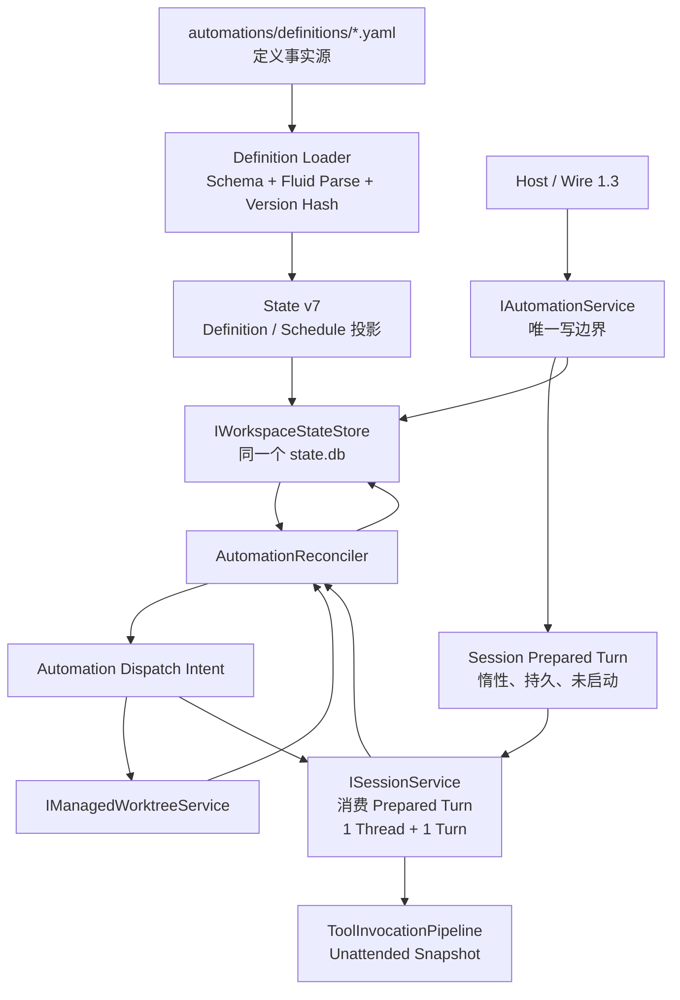

# OpenCoWork M8 Automations and Scheduler 详细设计

## 文档状态

- 状态：设计已冻结，实现已完成；Outcome 10 等待 `win-x64` 真机验收
- 日期：2026-07-30
- 所属里程碑：OpenCoWork Runtime 1.0 / M8
- 已确认决策：29 项
- 待确认决策：无
- 对应计划：
  [M8 Automations and Scheduler 实施计划](../plans/2026-07-30-open-cowork-m8-automations-scheduler-implementation-plan.md)
- 对应归档：待双平台真机验收后创建
- 继续工作前必须先阅读：
  - [OpenCoWork Runtime 1.0 路线规格](2026-07-25-open-cowork-runtime-1-0-roadmap.md)
  - [M0 Contract Freeze](2026-07-25-open-cowork-m0-contract-freeze-design.md)
  - [M0 能力台账](2026-07-25-open-cowork-m0-capability-ledger.md)
  - [M0-M10 验收目录](2026-07-25-open-cowork-m0-acceptance-catalog.md)
  - [M2 Durable Session Core 设计](2026-07-26-open-cowork-m2-durable-session-core-design.md)
  - [M3 Agent Runtime Alpha 设计](2026-07-27-open-cowork-m3-agent-runtime-alpha-design.md)
  - [M4 Tool Runtime Alpha 设计](2026-07-28-open-cowork-m4-tool-runtime-alpha-design.md)
  - [M5 Wire Alpha 设计](2026-07-28-open-cowork-m5-wire-alpha-design.md)
  - [M6 Capability Ecosystem 设计](2026-07-29-open-cowork-m6-capability-ecosystem-design.md)
  - [M7 Multi-Agent CoWork 设计](2026-07-30-open-cowork-m7-multi-agent-cowork-design.md)
  - `DotCraft_Core_核心代码详细设计与一比一复刻规范_v1.0.md`

本文冻结 M8 已确认的产品边界、定义模型、时钟语义、权限交集、Run 状态、
并发、Worktree、持久化、Wire 1.3、验证矩阵和 Outcome 边界。本文是后续计划的
设计基线；实施计划已经单独确认，但 Design + Plan 基线提交不授权开始编码。

修订 1 在 Outcome 5 开始前修复两项不能同时满足的原冻结表述：Run/Intent 必须先
持久化并可崩溃恢复，但 SQLite 又不得保存 Inputs 或 Rendered Prompt。修订后由
Session 持久边界暂存惰性的 Prepared Turn，Automation State 只保存稳定 ID 和摘要；
同时明确 Workspace Trust 与 Unattended Policy 复用 M6 Trust 和现有 Tool Policy，
不增加第二套信任文件或第五项 Automations Config。

M7 当前仍等待 `win-x64` 真机验收。M8 设计工作不得把 M7 标记为完成，也不得
把 M8 里程碑状态提前改为 In Progress。

## 1. 目标、范围与不变量

M8 在现有 Durable Session、Agent Runtime、Tool Runtime、Capability Ecosystem 和
M7 通用工作区基础设施上，增加安全、可版本控制、可恢复的无人值守执行：

- YAML Automation 定义；
- 受限 Fluid 模板与可验证输入；
- 手动触发与单 Cron 调度；
- 显式 IANA 时区和确定性 DST 语义；
- 定义、权限、Plugin、Skill 和 Tool 快照；
- Project / Managed Worktree 执行空间；
- 最大并发、单 Automation 互斥和 Lease；
- `NeedsAttention`、超时、取消与崩溃恢复；
- OpenCoWork Wire 1.3。

M8 必须保持以下不变量：

1. 一个 `AutomationRun` 只创建一个 Unattended Thread 和一个 Turn；
2. `ISessionService` 与 `ThreadJournal` 仍是 Thread、Turn、Item 和模型历史的唯一
   权威源；
3. `ToolInvocationPipeline` 仍是所有模型工具副作用的唯一入口；
4. YAML 是 Automation 定义的事实源，SQLite 只保存定义投影、Schedule 和 Run
   权威状态；
5. Run 创建时冻结定义、输入、权限和能力快照，后续热更新只影响新 Run；
6. M8 复用 Core State migration、Workspace state store、Session、Worktree、
   `TimeProvider` 和共享资源 Lease，不建立第二个数据库；
7. `OpenCoWork.Automations` 与 `OpenCoWork.Teams` 不互相引用；
8. 协议层只调用 M8 稳定服务边界，不复制调度状态机；
9. OpenCoWork 不读取或兼容 DotCraft 的 `.craft`、程序集或私有实现。

明确不包含：

- 直接启动 M7 Team / Mission；
- 多步骤 Workflow、任务 DAG 或第二套 Agent 编排器；
- 多 Schedule 数组、日历例外、节假日或事件触发；
- Gateway、Hub、外部渠道和远程执行；
- 独立模板仓库、模板继承、include/import 或任意文件读取；
- 自动 Commit、Merge、Rebase、Cherry-pick 或 Patch 应用；
- Run 级自动重试；
- ACP 扩展或 server-to-client request；
- 新 Provider 兼容性声明。

## 2. 权威架构



职责边界：

| 组件 | 职责 | 明确不负责 |
| --- | --- | --- |
| Definition Loader | 文件扫描、严格解析、Schema 校验、模板预解析、版本摘要、诊断 | 调度、创建 Run、保留旧定义继续执行 |
| `IAutomationService` | 查询投影、手动启动、取消、处理 Attention、Revision 和幂等命令 | 直接改 YAML、直接调用模型或 Git |
| `AutomationReconciler` | 到期、合并、Lease、Intent、Session 终态和恢复 | Thread/Turn 状态机、Tool 重放规则 |
| Core State | 同一数据库、迁移事务、写串行化、共享资源 Lease | Automation 业务决策 |
| `ISessionService` | 暂存 Prepared Turn、创建 Unattended Thread、提交一个 Turn、等待与恢复 | Automation Schedule 权威状态 |
| `ToolInvocationPipeline` | 快照、权限、审批、执行、结果不明和审计 | 因无人值守扩大权限 |
| Wire Adapter | 版本协商、DTO、参数校验和 Changed 通知 | 定义文件写入或第二套 Revision |

M8 拥有独立但很薄的 `AutomationReconciler`。它不并入 M7
`CoWorkReconciler`，也不推动 Core 出现通用 Workflow/Scheduler 框架。

## 3. Automation 定义

### 3.1 文件布局与身份

每个 Automation 使用一个自包含文件：

```text
.opencowork/automations/definitions/{automationId}.yaml
```

规则：

- `automationId` 使用稳定、可读的 lower-kebab-case；
- YAML 内的 `id` 必须与文件名一致；
- 显示名称可以修改，不改变 Automation 身份；
- 文件改名表示旧 Automation 被移除并创建新 Automation，不维护别名表；
- 一个文件只描述一个 Prompt、一个执行空间和至多一个 Cron；
- 定义删除只停止后续调度，不隐式取消已经创建的 Run。

### 3.2 Definition Schema v1

Definition 根对象不使用 `kind`、`metadata`、`spec` 等包装层。v1 字段固定为：

```yaml
schemaVersion: 1
id: nightly-maintenance
displayName: Nightly Maintenance
description: Optional description
enabled: true

schedule:
  cron: "0 2 * * *"
  timeZone: Asia/Shanghai

workspace:
  mode: worktree
  allowDirtyOrigin: false

prompt: |
  ...

inputSchema: {}
defaults: {}

allow:
  plugins: []
  skills: []
  tools: []
  effects: []

runTimeout: 30m
attentionTimeout: 24h
```

规则：

- `schemaVersion`、`id`、`displayName`、`enabled`、`workspace`、`prompt` 和
  `allow` 必填；
- `schemaVersion` 必须是整数 `1`，不接受字符串版本或未知版本；
- `description`、`schedule`、`inputSchema`、`defaults`、`runTimeout` 和
  `attentionTimeout` 可选；
- `schedule` 存在时，`cron` 与 `timeZone` 都必填；
- `workspace.mode` 只能是 `project` 或 `worktree`；
- `allowDirtyOrigin` 仅允许用于 `worktree`，缺失时为 `false`；
- `allow` 中各数组缺失时按空数组处理，始终只能缩小权限；
- 字段统一使用 camelCase、大小写敏感，任何层级的未知字段都使 Definition
  `Faulted`；
- 不对未知 Schema 版本做猜测解析或内存自动迁移。

### 3.3 固定安全上限

M8 使用固定硬限制，不增加配置项，也不允许 YAML 调大：

- `id` 为 1–64 位 lower-kebab-case；
- 单个 YAML 文件最大 256 KiB UTF-8；
- YAML 与 JSON 最大深度 64、最多 4096 个节点；
- 禁止重复键、Anchor、Alias 和自定义 Tag；
- Manual Inputs 的 canonical JSON 最大 256 KiB；
- Fluid 渲染结果最大 256 KiB，单次渲染 Deadline 为 2 秒。

Definition 文件、静态结构或固定字段超限时进入 `Faulted`。Manual Inputs 或本次
Fluid 渲染超限时不创建 Run。M8 不增加 Definition 数量上限，也不为每个普通文本
字段叠加独立配额；只有真实容量证据出现后才扩展。

### 3.4 严格解析与版本摘要

Definition Loader 使用以下顺序：

1. 只读取 `definitions` 目录直属的 `.yaml` 文件；
2. 以 YamlDotNet 反序列化到已知模型；
3. 拒绝未知字段、自定义 Tag、类型映射和任意对象构造；
4. 执行 Automation Definition JSON Schema 校验；
5. 校验 ID/文件名、Cron、IANA 时区、Input Schema、Defaults、权限和执行空间；
6. 预解析 Fluid 模板；
7. 将语义模型规范化为 canonical JSON；
8. 计算小写 SHA-256，得到不可变 `definitionVersion`。

YAML 注释、缩进和键顺序不改变 `definitionVersion`；任何语义字段改变都必须产生
新的版本摘要。

### 3.5 热更新与故障

Definition source 状态只有 `Ready`、`Faulted`、`Missing`；YAML `enabled` 独立
保存，不混入 source 状态。

文件监听只作为重新扫描提示。事件合并 250ms 后完整扫描目录；候选定义必须在当前
投影之外完成完整校验，成功后才原子发布。文件名 stem 始终作为投影键，非法 ID 或
YAML `id` 不匹配都会形成可诊断的 `Faulted` 投影。

当前 YAML 无效时：

- Definition 投影进入 `Faulted`；
- 停止创建新 Run；
- 不继续调度上一个有效版本；
- 清空可运行 Definition 与 Schedule 投影；
- 保存原始 `sourceSha256`，相同内容与诊断不重复递增 Revision；
- 每个 Definition 最多保存 32 个 `OpenCoWorkDiagnostic`
  (`code/severity/message/path`)；
- 诊断先脱敏，不含绝对路径、源码片段或 Secret；
- 已有 `Pending`、`Running` 和 `NeedsAttention` Run 继续使用自己的冻结快照；
- 修复后发布新版本，并按 Schedule 合并规则恢复。

文件删除时进入内部 `Missing` tombstone 并停用 Schedule；默认 List 不返回该项，
Get 返回 `automation.notFound`，历史 Run 仍可查询。同 ID 文件恢复时复用 tombstone
并递增 Revision。

## 4. 输入与 Fluid 模板

### 4.1 输入模型

M8 复用现有 JSON Schema 能力，不建设参数 DSL：

- 手动触发提交 `inputs`；
- Cron 触发只使用定义中的 `defaults`；
- 合并后的根值必须是 JSON Object；
- 合并结果必须先通过 `inputSchema`；
- Schema 或 Defaults 无效会使 Definition `Faulted`；
- 手动输入无效时不创建 Run。

### 4.2 模板上下文

Fluid 只暴露四个纯数据根：

```text
automation
run
trigger
inputs
```

其中：

- `automation` 只含 ID、显示信息和 `definitionVersion`；
- `run` 只含预生成但尚未持久化的 Run ID；
- `trigger` 只含 `manual|cron`、`scheduledForUtc` 和确定性触发元数据；
- `inputs` 是通过 Schema 校验后的 JSON 数据。

模板不得访问：

- 环境变量；
- Secret 值；
- 文件系统；
- 任意 .NET 对象或反射；
- 实时系统时钟；
- 网络、插件函数或自定义 Fluid Tag；
- 外部模板或 include/import。

Fluid 固定使用：

- `AllowModelMembers = false`；
- `StrictVariables = true`；
- 显式注入的 Liquid Value；
- 渲染输出大小和执行预算限制。

模板解析、变量缺失、渲染异常、输出超限或 Secret Canary 命中时，整个触发失败，
不得创建 Thread、Turn、Worktree 或半成品 Run。

## 5. Manual、Cron、时区与下一次运行

### 5.1 Schedule 数量

每个 Automation 最多一个 Cron Schedule：

- `schedule` 省略时，只能手动运行；
- 手动触发始终受 Definition 状态、权限和单实例互斥约束；
- 多个时间安排使用多份独立定义表达；
- 不支持 Schedule 数组、日历例外、节假日、依赖或事件触发。

因此 `automationId` 同时是唯一 Schedule 的稳定身份，不增加 Schedule 子 ID。

### 5.2 Cron 与时区

M8 使用 Cronos：

- 只接受 `CronFormat.Standard` 的 5 段表达式；
- YAML 必须提供显式 IANA 时区；
- 不继承 `TimeZoneInfo.Local`；
- `nextOccurrenceUtc` 从持久 UTC 基准和显式时区计算；
- 相同定义在 `win-x64` 与 `osx-arm64` 必须得到相同结果。

DST 采用 Cronos 的 Vixie Cron 语义：

- 春季不存在的本地时刻顺延到下一个有效时刻；
- 秋季回拨时，日历表达式的重复本地时刻只触发一次；
- 具体边界必须进入双平台固定 Corpus。

### 5.3 到期、停机与幂等

周期触发幂等键为：

```text
automationId + definitionVersion + scheduledForUtc
```

规则：

- `nextOccurrenceUtc` 在同一事务内随 Run 创建或合并记录推进；
- 重启不得因为内存 Timer 丢失而重复创建相同 Run；
- 运行时停机错过多个周期时，只保留最近一个 `scheduledForUtc`；
- 不追赶全部历史周期；
- 当前 Run 终态后，最多创建一个合并补跑 Run；
- Definition 版本变化后，新周期使用新版本和新的幂等键。

## 6. Run 创建与冻结快照

Run 创建前必须依次完成：

1. Definition 可运行性与 Revision 校验；
2. Trigger 幂等与单实例互斥校验；
3. Defaults / Inputs 合并和 JSON Schema 校验；
4. 生成候选 Run ID；
5. Fluid Prompt 渲染与 Secret 扫描；
6. 解析 Project / Worktree、Base Commit 和 Dirty Origin；
7. 计算 Workspace Trust、Unattended Policy 和 YAML allowlist 交集；
8. 冻结 Plugin、Skill、Tool Definition/Binding Generation 和权限快照；
9. 通过窄 Session 契约，以稳定 Prepared Turn ID 和 Request SHA-256 在
   `runtime/recovery/threads/prepared/` 原子暂存 Secret Canary 已通过的 Rendered
   Prompt；该步骤不创建 Thread、Turn 或执行任务；
10. 在单个 `BEGIN IMMEDIATE` 事务中创建 `Pending` Run、必要 Intent、
    Command Receipt，并推进 Schedule。

Run 至少冻结：

- `automationId` 和 `definitionVersion`；
- 规范化 Definition Snapshot；
- Trigger Kind、`scheduledForUtc` 和触发幂等键；
- 已验证 Inputs SHA-256、Rendered Prompt SHA-256 和 Prepared Turn ID；完整
  Rendered Prompt 仅存在 Session Prepared Turn / Thread Journal，原始 Inputs
  不持久化；
- Project / Worktree 模式、Base Commit 和执行空间请求；
- Workspace Trust Snapshot ID；
- Unattended 权限决策；
- Run 创建时有效的 `ModelsConfig.DefaultProvider` 与 `DefaultModel`；
- Plugin、Skill、Tool Definition、Binding Generation 和 Catalog Revision；
- Run / Attention Deadline；
- Command / Correlation ID。

能力快照保存稳定身份、版本、摘要和生成号，不序列化运行时委托或 Secret。执行时
Binding 已卸载、Generation 改变或 Lease 失效必须失败关闭，不能偷偷换用新能力。

### 6.1 结果、Thread 与保留

`automation_runs` 只保存终态、时间、`threadId`、`worktreeId`、安全错误和最多
16 KiB UTF-8 的最终摘要。完整 Prompt、消息、工具调用与输出继续由 Thread Journal
权威保存，不复制进 Automation State。

Session Prepared Turn 是 Thread Journal 的窄写前暂存，而不是 Automation Outbox：

- 文件只包含 Prepared Turn ID、Request SHA-256、Rendered Prompt、创建 UTC 和
  完整性摘要，不保存原始 Inputs、Secret、运行时委托或能力对象；
- 写入使用 Session Runtime 现有路径守卫、临时文件、原子替换、WriteThrough 和
  Secret Canary；相同 ID + Request SHA-256 幂等重放，不同请求返回冲突；
- Prepared Turn 在 Run 事务前写入；事务失败时立即删除，进程崩溃遗留且两分钟后
  仍无 Run/Receipt 引用的暂存由 Reconciler 删除；
- Run 事务成功后，Dispatch Intent 只引用 Prepared Turn ID；Worktree 和 Thread
  创建完成后，Session 将同一 Prompt 提交为唯一 Turn；
- 只有 Thread Journal 已确认唯一 Turn 后才删除 Prepared Turn；删除前崩溃时按
  稳定 ID 和 Request SHA-256 探测重放；
- Run 引用的 Prepared Turn 缺失、摘要不符或损坏时 fail-closed，经固定 Intent
  尝试耗尽后使用 `automation.retryExhausted` 终结，不从当前 YAML 或新 Inputs
  重新渲染。

规则：

- `automationRun/list` 只返回紧凑元数据，`automationRun/get` 才返回摘要和关联 ID；
- `Running` 与 `NeedsAttention` Thread 保持 Active；
- Run 进入终态后创建 Archive Thread Intent；
- 归档失败不回滚或改写 Run 终态，由 Reconciler 按幂等 Intent 重试；
- 默认 Thread List 继续使用 `IncludeArchived = false`，避免 Automation Thread
  刷屏；
- 用户可通过 `threadId` 查看完整归档历史，也可显式 Unarchive；完成后的 Archive
  Intent 不会再次覆盖用户的 Unarchive；
- M8 不自动删除 Run 或 Thread，不增加 `retentionDays` 或 Run Delete；
- Thread 被用户显式删除后，Run 仍保留摘要，查询时将关联可用性投影为 `Deleted`。

## 7. 权限与无人值守边界

### 7.1 三重激活门

新 Run 只有在以下条件全部成立时才能创建：

```text
automations.enabled == true
AND Workspace Trust 允许 Unattended Automation
AND YAML enabled == true
```

精确语义：

- `automations.enabled` 缺失或为 `false` 时，Automations 模块关闭；
- Workspace Trust 未授权时，Definition 保持可见，但执行关闭；
- YAML `enabled` 必填，缺失会使 Definition `Faulted`；
- YAML `enabled: false` 是有效的禁用 Definition；
- 任一激活条件关闭都只停止新 Run，不隐式取消已有非终态 Run；
- 仓库中仅出现 YAML 文件不能自动获得无人值守执行权。

Workspace Trust 复用 M6 `trust/decide` / `trust/revoke` 与用户级
`~/.opencowork/trust/decisions.json`：

- M8 增加 `CapabilityTrustScope.UnattendedAutomation`；
- 稳定信任身份为 Core source `opencowork.automations`、版本 `1`，Source SHA-256
  来自固定 canonical descriptor；descriptor 变化会使旧决定失效并要求重新授权；
- Automation Definition 查询返回该稳定 source descriptor 与当前授权状态，Host
  仍通过 M6 Capability Trust 命令授权，不新增 Automation 专用 Trust API；
- Run 保存匹配决定和 source descriptor 的 canonical SHA-256 作为
  Workspace Trust Snapshot ID，不保存用户级信任文件正文。

### 7.2 有效权限

Run 有效权限为：

```text
Workspace 当前 Trust
∩ Workspace Unattended Policy
∩ Automation YAML 请求的 allowlist
∩ Run 创建时有效的 Plugin / Skill / Tool Catalog
```

规则：

- YAML 只能缩小权限，不能授予权限；
- Workspace Unattended Policy 直接复用现有 `ToolsConfig.Effects`，不增加平行
  Policy 文件或配置段；
- `Allow` 才允许对应 Effect 无人值守自动执行，`RequireApproval` 保留工具但必须
  经 Session Approval 进入 `NeedsAttention`，`Deny` 从有效权限中移除；
- 写文件、执行进程或访问网络必须由 `ToolsConfig.Effects` 显式 `Allow` 才能自动
  执行；`ExternalMutation` 沿用 M6 约束，不能配置为 `Allow`，因此始终需要审批或
  被拒绝；
- `ToolPlanningThreadKind` 使用 `Unattended`；
- Plan、Audience、Exposure、Binding Lease、Authority、Policy、Hook 和 Approval 顺序
  继续由 `ToolInvocationPipeline` 决定；
- 仍需审批的调用进入 `NeedsAttention`，不得通过 Console 自动批准；
- Plugin Prompt、Skill 或 Tool 描述不能扩大 Run Authority；
- Secret 只引用 M6 凭据标识，值不写入 YAML、Snapshot、SQLite、Journal、Wire
  通知或日志；
- 动态工具和外部绑定断连时按冻结 Binding 失败，不回退到同名新工具。

## 8. Run 状态机与 NeedsAttention

### 8.1 状态机

```text
Pending
  -> Running
  -> Cancelled

Running
  -> NeedsAttention
  -> Completed
  -> Failed
  -> Cancelled
  -> TimedOut

NeedsAttention
  -> Running       (Approval / UserInput 恢复同一 Turn)
  -> Failed
  -> Cancelled
  -> TimedOut
```

约束：

- 一个 Run 只有一个 Thread 和一个 Turn；
- `NeedsAttention` 不是 Session Turn 的替代状态，而是 Automation 对持久 Session
  等待或 `OutcomeUnknown` 的投影；
- Run 终态不删除 ThreadJournal；
- Run 状态只能依据持久 Session / Intent 事实推进，不能按内存 Task 是否存在猜测。

### 8.2 Attention 原因与动作

M8 至少区分：

| 原因 | 可执行动作 | 恢复语义 |
| --- | --- | --- |
| `ApprovalRequired` | Approve / Reject / Cancel | 通过 Session Checkpoint 恢复同一个 Turn |
| `UserInputRequired` | ProvideInput / Cancel | 通过 Session Checkpoint 恢复同一个 Turn |
| `OutcomeUnknown` | Fail / Cancel | 不恢复、不重放、不伪造成功 |

`OutcomeUnknown` 表示非幂等副作用可能已经发生。若操作者确认外部状态后仍要执行，
必须先终结当前 Run，再手动创建全新 Run；新 Run 使用新幂等键，并明确承担潜在重复
副作用风险。

`NeedsAttention` 期间：

- 保留 Thread、Worktree 和诊断；
- 继续持有并续租 Run ownership lease，进程失联后允许新 Reconciler 接管；
- 继续占用该 Automation 的单实例互斥；
- 不占用正在执行的全局并发槽；
- 不领取新的执行资源 Lease；
- 到达 Attention Deadline 后进入 `TimedOut`；
- 终态后按最新到期点重新计算下一周期。

取消或超时时若工具结果变为 `OutcomeUnknown`，`NeedsAttention` 优先，不能用
`Cancelled` 或 `TimedOut` 掩盖外部副作用风险。

## 9. 并发、互斥、Lease 与重试

### 9.1 单实例与全局并发

- 同一 Automation 最多一个非终态 Run：
  `Pending`、`Running` 或 `NeedsAttention`；
- Cron 在活跃 Run 期间再次到期时，不创建第二个 Run，只记录最新到期点；
- 当前 Run 终态后，最多创建一个合并补跑 Run；
- 活跃期间手动触发返回 `automation.runConflict`，不排队；
- Workspace 默认最多 3 个 Automation Run 同时 `Running`；
- 正确性由 SQLite 事务、唯一约束和 Lease 决定，内存 Semaphore 只减少无效唤醒。

### 9.2 Lease

M8 复用 M7 固定 Lease 常量：

- Dispatch Lease：2 分钟；
- Renewal：30 秒；
- Intent 最大尝试：5 次。

过期 Lease 可以被同一 Workspace 的新 Reconciler 接管；未过期 Lease 不得并行重复
创建 Thread、Turn 或 Worktree。

### 9.3 重试边界

M8 不自动重试完整 Run：

- Provider 瞬时重试由 M3 负责；
- Safe Tool Replay 和 `OutcomeUnknown` 由 M4 负责；
- M8 只重试具有稳定幂等键的基础设施 Intent；
- `Failed`、`Cancelled`、`TimedOut` 后重跑必须创建新 Run；
- 不增加 Stall Timeout。

默认：

- `runTimeout`：30 分钟；
- `attentionTimeout`：24 小时；
- YAML 可以缩短，但不能超过 Workspace 对应上限。

### 9.4 配置边界

`automations` Config Section 只开放四个 Workspace 策略字段：

```jsonc
{
  "automations": {
    "enabled": false,
    "maxConcurrentRuns": 3,
    "maximumRunTimeout": "30m",
    "maximumAttentionTimeout": "24h"
  }
}
```

约束：

- `maxConcurrentRuns` 范围为 1–16；
- `maximumRunTimeout` 范围为 1m–24h；
- `maximumAttentionTimeout` 范围为 1m–168h；
- YAML `runTimeout` 与 `attentionTimeout` 必须大于零且不超过对应 Workspace
  上限；
- YAML `allow` 继续只缩小 Workspace Policy 与 Catalog 能力；
- Provider 与 Model 复用现有 `ModelsConfig` 默认值，并在 Run 创建时冻结；
- M8 不提供 Definition 级 Provider/Model 覆盖。

Lease 2 分钟、续约 30 秒、Intent 5 次、停机合并、watcher 250ms、安全大小上限、
Fluid 2 秒、Cron/DST、诊断 32 条和摘要 16 KiB 都是固定行为，不开放 Config 或 YAML
旋钮。

## 10. Project 与 Managed Worktree

YAML 必须显式选择 `project` 或 `worktree`，运行时不得根据 Tool 集合猜测模式。

### 10.1 Worktree

每个 Worktree Run 使用冻结的 Base Commit 创建独立 Detached Worktree：

```text
git worktree add --detach <managed-path> <base-commit-sha>
```

规则：

- 每个 Run 一个 Worktree，不跨周期复用；
- 路径位于 `.opencowork/runtime/worktrees/{automationRunId}/`；
- Origin Dirty 时默认拒绝；
- `allowDirtyOrigin=true` 只表示显式忽略未提交内容，未提交内容不会进入 Worktree；
- Git、进程、Trust、路径和 Secret 处理复用 M6/M7 边界；
- Run 终态后，只有 Worktree 干净且 `HEAD == BaseCommit` 时才自动清理；
- Dirty 或 `HEAD != BaseCommit` 必须保留；
- 自动化不得自动 Commit、Merge、Rebase、Cherry-pick 或 Patch；
- Intent 重放必须探测已存在的路径和 Git Worktree 注册，不能重复创建。

### 10.2 Project

- Project 模式直接绑定 Workspace Root；
- 有效能力包含 `WorkspaceWrite` 的 Run 必须取得 Workspace 级共享写 Lease；
- ReadOnly Run 可以在全局并发限制内并行；
- M8 与 M7 必须共享同一 Project Writer 互斥，不得各建一把锁；
- Project Lease 不能阻止用户或外部进程修改文件，因此不承诺与人工编辑隔离。

Core 在 Abstractions 暴露单用途 `IProjectWriterLeaseService`，只支持
`coWorkAgentRun` 与 `automationRun` 两种 Owner。它提供 `TryAcquire`、`Renew` 和
`Release`，返回并校验不透明 `leaseId`；不扩展为通用 Resource Lock 框架。

共享 Lease 使用 Core 单例表 `project_writer_lease`。Acquire、Renew、Release 都在
SQLite 事务内按 `leaseId` 做 CAS：

- Lease 固定 2 分钟，每 30 秒续约；
- 过期 Lease 可被新 Owner 原子接管；
- M7 保留 `ix_agent_runs_project_writer`，并在启动 Project Writer 前额外取得共享
  Lease；
- M8 的只读 Project Run 与所有 Worktree Run 不领取该 Lease；
- Lease 丢失后立即停止新工具调用并取消当前 Turn；
- 在途副作用无法证明结果时进入 `OutcomeUnknown`，否则以
  `automation.leaseLost` 失败；
- 不建设等待队列或公平调度器，Pending Run 由各自 Reconciler 重试。

## 11. SQLite State v7

M8 将 Workspace State Schema 从 v6 升到 v7。`OpenCoWork.Automations` 通过
`IWorkspaceStateMigrationContributor` 提交迁移片段；Core 负责备份、全局事务、
结构与外键校验。M8 不直接引用 `Microsoft.Data.Sqlite`。

v7 总计增加 7 张表：M8 自有 6 张，Core 共享 1 张。

| 表 | 最小权威内容 |
| --- | --- |
| `project_writer_lease` | Core 单例 Project Writer Owner、Lease ID 与到期 UTC |
| `automation_state` | Workspace 单例 `automationRevision` 与更新时间 |
| `automation_definitions` | ID、文件相对路径、Source 状态/摘要、当前版本、可运行投影、Revision、诊断与 tombstone |
| `automation_schedules` | Automation、Cron、IANA 时区、next/last/coalesced UTC、Revision |
| `automation_runs` | Trigger、状态、冻结快照、Inputs/Prompt SHA-256、Prepared Turn ID、Thread、Worktree、Deadline、Lease、安全错误、16 KiB 摘要与诊断 |
| `automation_dispatch_intents` | Side-effect 类型、实体、幂等键、Attempt、Lease、状态、诊断 |
| `automation_command_receipts` | Command ID、Actor、类型、目标、结果、Revision |

约束：

- `project_writer_lease` 只有一个可领取的单例资源行；
- `automation_state` 只有 `id = 1` 的单例行；
- ID 使用 UUIDv7；Automation ID 使用定义中的稳定 lower-kebab-case；
- Schedule 与 Automation 一对零或一；
- 同一 Automation 最多一个非终态 Run，使用数据库部分唯一索引保证；
- 周期触发幂等键唯一；
- Thread ID、Worktree ID 和 Dispatch Intent 幂等键唯一；
- JSON Snapshot 必须 `json_valid`；
- Deadline、Lease 和时间字段统一保存 UTC；
- SQLite 不保存 Inputs、Rendered Prompt、Secret、完整 Thread 历史或运行时委托；
- 不增加定义版本历史表、事件表、Outbox、Repository 或 Unit of Work。

定义历史由 Git 提供；Run 自身保存当时的完整规范化 Snapshot，足以审计历史行为。

### 11.1 Revision

M8 同时维护一个 Workspace 级 `automationRevision` 和三类实体 Revision：

- Definition、Schedule、Run 创建时从 `revision = 1` 开始；
- `definitionVersion` 是 canonical Definition 的 SHA-256，不承担并发控制；
- 只有持久投影真实变化才递增对应实体 Revision；
- Definition 文件更新、故障、恢复或删除，Schedule 推进以及 Run 状态变化，都在
  同一事务内递增实体 Revision 与 `automationRevision`；
- 重复 watcher 事件、mtime 变化和 canonical 内容未变化不递增；
- `automationRun/start.expectedRevision` 校验当前 Definition Revision；
- `automationRun/cancel.expectedRevision` 与
  `automationRun/resolveAttention.expectedRevision` 校验当前 Run Revision；
- Schedule 没有写方法，Revision 仅用于查询和通知。

M8 不增加 Revision History、Event、Outbox，也不复用 Core `state_info` 或 M7
`cowork_state` 保存 Automation Revision。

## 12. AutomationReconciler

Reconciler 每轮按固定顺序处理：

1. 响应显式取消和已到期 Run / Attention Deadline；
2. 从 Session 持久事实恢复 `Running` / `NeedsAttention` / 终态；
3. 探测并修复 Prepared Turn、Thread、Turn 和 Worktree Intent 的未知结果；
4. 回收过期 Dispatch Lease；
5. 计算 Cron 到期、停机合并点与下一次运行；
6. 在事务内创建 Run / Intent 或领取 Pending Run；
7. 在事务外消费 Prepared Turn 并执行 Worktree、Thread 和 Turn 副作用；
8. 以相同幂等键写回结果；
9. 为新终态 Run 提交并执行 Archive Thread Intent；
10. 自动清理无变化的 Worktree；
11. 发布轻量 Changed 通知。

唤醒来源：

- Workspace 启动；
- Definition 文件变化；
- 下一个 Schedule 时间点；
- Automation 写事务提交；
- Session Waiting / Terminal 事件；
- Lease、Run Timeout 或 Attention Deadline 到期。

内存 Channel 只合并唤醒，不保存 Run。正常 Stop 不把非终态 Run标记为失败。

## 13. OpenCoWork Wire 1.3

Wire 1.3 是 1.0 / 1.1 / 1.2 的纯增量扩展：

- 旧方法、错误和事件语义不变；
- 只有协商到 1.3 的连接才能看到 M8 方法；
- 不扩展 ACP；
- 不增加 server-to-client request；
- YAML 仍是 Definition 事实源。

### 13.1 Actor 与可见性

M8 只定义两类 `AutomationActorContext`：

- `Host`：外部控制面；
- `Scheduler`：内部 Cron/Reconciler，不能从 Wire 反序列化或构造。

规则：

- Wire 九个方法全部要求现有 `ConnectionAuthority`；
- 所有 List/Get 仅 Host 可读，包括 `Faulted` 与 Disabled Definition；
- `automationRun/start`、`cancel`、`resolveAttention` 仅 Host 可写；
- Wire Host Principal 继续使用 `wire:{connectionId}`；
- Cron 创建 Run 使用 Scheduler Actor 与周期幂等键，不伪装 Host，也不写外部
  Command Receipt；
- Scheduler 不得批准、拒绝、提供输入或处理 `OutcomeUnknown`；
- M8 不向模型暴露 Automation 管理工具，避免自触发、自批准或取消其他 Run；
- Wire 1.3 以下隐藏全部 Automation 方法；ACP 不增加 Automation 方法。

`AutomationActorContext` 不复用 M7 的 `CoWorkActorContext`，也不增加 Thread、
Mission 或 Member Actor。

### 13.2 方法

```text
automation/list
automation/get

schedule/list
schedule/get

automationRun/start
automationRun/list
automationRun/get
automationRun/cancel
automationRun/resolveAttention
```

M8 不提供：

```text
automation/create
automation/update
automation/delete
automationRun/retry
```

`automationRun/list` 不携带结果正文；`automationRun/get` 返回安全摘要、`threadId`、
`worktreeId` 和关联可用性。完整对话继续通过 Session API 查询。

所有写方法使用 `commandId + expectedRevision`。`start` 的 Revision 指向
Definition；`cancel` 与 `resolveAttention` 的 Revision 指向 Run。命令重放返回原
结果，不重复创建 Run、Thread、Turn 或 Worktree。

`automationRun/resolveAttention` 根据原因限制负载：

- Approval：Approve / Reject；
- UserInput：ProvideInput；
- OutcomeUnknown：Fail / Cancel。

### 13.3 DTO 与分页

Service 内部结果复用 M7 的 Domain Result 方向：

```text
AutomationResult<T>
- value
- automationRevision
- isReplay
- error
```

Wire 不复制 Domain Error 包络。成功结果固定为：

```text
WireAutomationResponse<T>
- automationRevision
- value
```

Domain Error 由 Adapter 投影到现有 JSON-RPC Error；`isReplay` 仅供 Service 与
通知抑制使用，不进入 Wire 成功结果。分页值继续使用
`AutomationPage<T>(items, nextCursor)`。

分页规则：

- `pageSize` 默认 100，范围 1–100；
- Cursor 使用不透明 Base64URL keyset，不使用 offset；
- Definition 与 Schedule 按 `automationId ASC`；
- Run 按 `createdAt DESC, runId DESC`；
- Run List 只支持可选 `automationId` 与单个 `status` 过滤；
- Definition/Schedule List 不增加过滤、排序、字段选择或搜索。

DTO 边界：

- Definition List：身份、名称、Enabled、Source 状态、版本、是否有 Schedule、
  Revision；
- Definition Get：再增加 Workspace-relative source path、规范化 v1 Definition 与
  脱敏诊断；
- Schedule List/Get：Cron、时区、next/last/coalesced UTC 与 Revision；
- Run List：身份、Automation、Trigger、状态、Attention Kind、时间与 Revision；
- Run Get：再增加安全摘要/错误、Thread/Worktree、Deadline、Provider/Model，以及
  冻结权限和能力身份/摘要；
- Run Get 不直接返回 Inputs、Rendered Prompt 或工具输出，完整内容通过 Thread
  查询。

写请求固定为：

```text
start:
  automationId, inputs, commandId, expectedRevision

cancel:
  runId, commandId, expectedRevision

resolveAttention:
  runId, attentionId, resolution, commandId, expectedRevision
```

`resolution` 只允许 `approve`、`reject`、`provideInput(text)`、`fail`、`cancel`；
Service 必须校验 Resolution 与当前 Attention Kind 匹配。M8 不增加批量接口。

### 13.4 通知

```text
automation/changed
schedule/changed
automationRun/changed
```

通知只携带全局 Automation Revision、变更种类和实体 ID，不携带 Prompt、Inputs、
审批内容、路径、诊断正文或 Secret。客户端按 Revision 调用 Get/List 获取当前投影。
Definition 的变更种类固定为 `upserted`、`faulted`、`restored`、`removed`。

## 14. 模块生命周期

### 14.1 Configure

Automations 模块注册：

- `AutomationsConfig` Config Section；
- State v7 Migration Contributor；
- `IAutomationService`；
- Definition Loader；
- `AutomationReconciler`；
- Wire 1.3 Handler 与通知投影；
- Unattended Tool / Session 绑定扩展。

Wire 和 Tool Definition 可以进入 Catalog，但模块未 Start 前 Binding 必须不可用。

### 14.2 Start

顺序固定为：

1. Core 备份、迁移并验证 State v7；
2. Session Runtime 完成恢复；
3. 完整扫描 Definition 目录并建立有效/故障投影；
4. 恢复 Schedule、Run、Intent、Lease、Thread 和 Worktree；
5. 订阅 Definition 与 Session 事件；
6. 启动 Reconciler；
7. 发布 Wire / Tool Binding。

State v7 迁移/完整性、必要依赖或初次 Definition 全量扫描无法建立安全基线时，
Automations `StartAsync` 失败，由现有 Host 启动回滚进入 Runtime `Faulted`。全局
开关关闭时不启动 Automations 模块；Workspace Trust 不足时仍发布 Definition
只读投影，但不创建 Run。

### 14.3 Degraded 与实体隔离

M8 不增加独立的公共健康状态机，复用现有
`WorkspaceRuntime.ReportDegraded("automations", reason)` 与
`ClearDegraded("automations")`：

- 单个 Definition 的 YAML、Schema、Cron、时区、模板或权限故障，只更新该
  Definition 为 `Faulted`；
- 单个 Run 的能力、路径、Worktree、Lease、Intent、Timeout 或 Outcome 故障，
  只推进该 Run；
- Faulted Definition 的数量不触发模块 Degraded；
- 配置关闭、Trust 未授权或 Definition Disabled 都不是故障；
- 只有成功 Start 后，共享控制面已无法安全创建新 Run 时才报告 Degraded，例如
  Definition Source 新鲜度无法确认、Reconciler / Scheduler 失效，或运行期 State
  Store 不可用。

进入 Degraded 后：

1. 立即停止 Cron Claim、Manual Start 和新 Run 的副作用；
2. List/Get 在其 State 依赖可用时继续服务，否则返回
   `automation.unavailable`；
3. 已有 Run 不统一取消，继续使用冻结快照和各自依赖；
4. Cancel / Resolve 仅在其 State 与 Session 权威可用时执行，否则返回
   `automation.unavailable`；
5. 若具体故障使某个 Run 的副作用结果不明，仍按既有
   `OutcomeUnknown -> NeedsAttention` 处理。

只有同一共享边界恢复、State 校验通过、Definition 全量扫描成功且 Reconciler
完成一轮收敛后，才调用 `ClearDegraded("automations")`。恢复后按既有 coalesce
规则重新计算 Schedule，不补跑历史周期。健康信号是进程态，不新增表、不持久化；
重启后重新执行 Start 基线检查。

### 14.4 Stop

顺序固定为：

1. 将 Automations Binding 标为不可用；
2. 停止创建 Run 和领取新 Lease；
3. 停止文件监听和时钟唤醒；
4. 等待 Reconciler 临界区退出；
5. 释放本进程 Lease；
6. 取消 Session 订阅。

正常 Stop 不把 Run 标为 Failed、Cancelled 或 TimedOut。进程重启后按 State、Intent
和 Session Journal 恢复。

## 15. 稳定错误契约

M8 公共 Domain Error 统一使用 `automation.*`，并复用现有 JSON-RPC 数字码，
不增加新的数字错误类别：

| JSON-RPC | 稳定错误 |
| ---: | --- |
| `-32000` Business | `automation.permissionDenied`、`automation.secretDetected`、`automation.pathEscape`、`automation.worktreeDirty` |
| `-32001` Conflict | `automation.conflict`、`automation.runConflict` |
| `-32002` Not Found | `automation.notFound` |
| `-32003` Invalid State | `automation.invalidState`、`automation.invalidCursor`、`automation.definitionInvalid`、`automation.inputInvalid`、`automation.outcomeUnknown` |
| `-32004` Unavailable | `automation.unavailable`、`automation.capabilityUnavailable`、`automation.leaseLost`、`automation.retryExhausted`、`automation.schemaInvalid` |
| `-32005` Cancelled | 仅表示当前 JSON-RPC 请求被取消；Run 的 `Cancelled` 是状态而不是错误 |

语义固定为：

| 错误 | 含义 | Retryable |
| --- | --- | :---: |
| `automation.notFound` | Definition、Schedule 或 Run 不存在或不可见 | No |
| `automation.conflict` | Revision、Command 或幂等键冲突，必须先刷新或修改请求 | No |
| `automation.runConflict` | 同 Automation 已有非终态 Run | Yes |
| `automation.invalidState` | 当前状态或 Attention Kind 不允许命令 | No |
| `automation.invalidCursor` | Cursor 无法解析或与查询形状不匹配 | No |
| `automation.definitionInvalid` | 当前 Definition 的 YAML、Schema、Cron、时区或模板无效 | No |
| `automation.inputInvalid` | Manual Inputs、Defaults 或 Render 结果不满足契约 | No |
| `automation.permissionDenied` | Actor、Trust 或 Unattended Policy 拒绝 | No |
| `automation.secretDetected` | Definition、Inputs 或 Render 结果触发敏感数据保护 | No |
| `automation.capabilityUnavailable` | 冻结的 Plugin、Skill 或 Tool Binding 暂不可用 | Yes |
| `automation.pathEscape` | Project 或 Worktree 路径越界 | No |
| `automation.worktreeDirty` | Dirty Origin 或受保护 Worktree 操作 | No |
| `automation.outcomeUnknown` | 非幂等副作用结果不明，必须人工 Fail 或 Cancel | No |
| `automation.leaseLost` | Project Writer Lease 丢失且当前 Run 不能透明继续 | No |
| `automation.retryExhausted` | 幂等基础设施 Intent 的固定重试耗尽 | No |
| `automation.schemaInvalid` | State v7 迁移或结构完整性失败 | No |
| `automation.unavailable` | Automation 模块或共享运行依赖暂不可用 | Yes |

YAML 字段级错误只作为脱敏 `OpenCoWorkDiagnostic` 返回，不扩张成公共 Wire
错误码。Run 中保存的安全错误可以使用同一组 `automation.*` Code；读取失败 Run
仍返回成功的 Run Snapshot，不把其终态错误重新抛成 JSON-RPC Error。

JSON-RPC Error 继续使用现有 `WireErrorData`。CAS 冲突的
`currentRevision` 返回目标 Definition 或 Run 的实体 Revision，
`currentSequence = null`；不为 M8 增加第二套 Error Data。协议层解析失败、请求形状
错误、未知方法和内部异常继续使用 `-32700`、`-32600`、`-32601`、`-32602`、
`-32603`，不使用 `automation.*`。

## 16. 验收映射

| 验收编号 | 当前设计证据入口 |
| --- | --- |
| M8-ACC-001 | 单 YAML、严格 Schema、canonical JSON、稳定 `definitionVersion` |
| M8-ACC-002 | Fluid 四根上下文、Strict Variables、无对象/文件/Secret、Run 前失败 |
| M8-ACC-003 | Manual/单 Cron、IANA、Cronos DST、持久 next-run、周期幂等键 |
| M8-ACC-004 | Run Definition/Input/Permission/Plugin/Skill/Tool 冻结快照 |
| M8-ACC-005 | 全局并发 3、单 Automation 部分唯一索引、Lease、每 Run Worktree |
| M8-ACC-006 | `OutcomeUnknown -> NeedsAttention`，禁止自动或同 Run 重试 |
| M8-ACC-007 | Trust/Unattended/YAML/Catalog 权限交集，不读 Console |
| M8-ACC-008 | State v7、Intent、Lease、Session/Worktree 探测与 Reconciler |
| M8-ACC-009 | Wire 1.3 Attention 恢复、Fail/Cancel/Timeout 和周期重排 |

### 16.1 确定性测试与故障注入

纯逻辑测试至少覆盖：

- Definition valid/invalid Corpus、未知字段、Tag、路径和版本摘要快照；
- Fluid 未定义变量、对象逃逸、输出上限和 Secret Canary；
- Cron 5 段、IANA、春季跳时、秋季回拨和停机合并 Corpus；
- 运行中修改 Definition、Plugin、Skill、Tool Binding 的冻结对照；
- Approval、UserInput、OutcomeUnknown、Deadline 与下一周期重排；
- Wire 1.0 / 1.1 / 1.2 全回归和 1.3 隐藏、Revision、幂等、Changed 投影。

故障注入复用 M7 的内部 `Action<FaultPoint>` 方式，仅通过内部构造参数进入测试，
不增加生产配置、环境变量或通用故障框架。注入面覆盖：

1. Run / Intent 已提交但尚未执行；
2. Worktree Create、Thread Create、Turn Submit、Interaction Resolve、Thread
   Archive、Worktree Cleanup 的副作用前后；
3. 外部副作用成功但 Intent 结果尚未提交；
4. Session Waiting / Terminal 已观察但 Run 状态尚未提交；
5. Lease 到期、Owner 接管以及通知丢失、重复；
6. Definition Watcher 事件丢失、重复、乱序后的全量扫描；
7. M4 Fake Tool 提交副作用后中断。

每个崩溃窗口固定验证资源不重复、终态唯一、重启后继续收敛。Unsafe Tool 额外使用
外部副作用计数器证明不会自动重放，只能进入
`OutcomeUnknown -> NeedsAttention`。

### 16.2 结构化日志与性能观测

M8 只复用现有 `ILogger`、JSONL Sink 和 `SecretRedactor`。结构化事件固定覆盖：

- Definition Scan；
- Reconcile Cycle；
- Schedule Coalesced；
- Run Transition；
- Intent Attempt；
- Module Health Changed。

字段只允许安全 ID、Revision、状态、Trigger / Intent Kind、Attempt、UTC 时间点、
耗时和稳定错误码。不得记录 YAML 正文、Inputs、Rendered Prompt、Approval /
UserInput 正文、绝对路径、Secret、Lease Token 或 Provider 原始内容。

固定性能验证负载为：

- 1,000 个 Definition，其中 10% Faulted，验证全量扫描和 Revision 去噪；
- 64 个并发 Start、`maxConcurrentRuns = 16`，验证全局容量、单 Automation 和跨
  M7/M8 Project Writer Lease；
- 10,000 个历史 Run，以 100 条 keyset 分页完整遍历，验证无重复、无遗漏。

测试记录耗时、Schedule Lag、每轮 Reconcile 数量和 SQLite Busy 次数，但 M8
不设置产品延迟 SLA。M10 根据双平台发布基线决定是否增加性能门槛。M8 不引入
OpenTelemetry、`Meter`、指标服务、Dashboard 或性能数据库。

### 16.3 双平台真机矩阵

`win-x64` 与 `osx-arm64` 都必须从各自发布目录真实运行 App 与 TestClient，并执行：

1. 相同 IANA / DST Corpus；
2. Definition 原子替换、重命名、删除和恢复；
3. 进程强制终止后的 Run、Intent 与 Lease 恢复；
4. Worktree、Dirty Retention 和带空格路径；
5. macOS Symlink 与 Windows Junction / Reparse Point；
6. Timeout / Cancel 后子进程树残留检查；
7. Wire 1.0–1.2 回归与 Wire 1.3 Automation 场景；
8. State、Journal、日志、Wire、stdout、stderr 与 Worktree 的 Secret Canary。

M8 使用确定性 Fake Agent / Tool，不要求真实 Provider。交叉发布只能证明产物可生成，
不能替代 M8-ACC-003、M8-ACC-008 所需的双平台真机证据；结果统一回填
`docs/platform-release-validation-ledger.md`。

## 17. Outcome 与交付边界

M8 后续实施计划必须保持以下十个 Outcome，不把迁移、公共契约、黑盒 Wire 或
双平台收口拆成无法独立验收的零碎提交：

| Outcome | 独立交付边界 |
| ---: | --- |
| 1 | Automation 契约、Config、模块生命周期、依赖与架构边界 |
| 2 | State v7 七张表、迁移完整性、Core Project Writer Lease，并让 M7 接入共享 Lease |
| 3 | YAML、Schema、canonical hash、Inputs、Fluid、诊断与安全上限 |
| 4 | Source Watch / 全量扫描、Faulted / Missing 投影、Cron / IANA / DST 与 Schedule Revision |
| 5 | Query、分页、Trust / Policy 激活、Manual Start、Command Receipt 与冻结快照 |
| 6 | Dispatch Intent、Project / Worktree、一个 Thread + Turn 与副作用探测 |
| 7 | Cron Claim、并发、Lease、Reconciler 恢复与模块 Degraded |
| 8 | Approval / Input / OutcomeUnknown、Cancel、Timeout、Thread Archive 与 Worktree Retention |
| 9 | Wire 1.3 全方法、错误映射、通知、版本隐藏和 TestClient 黑盒 |
| 10 | 故障、安全、性能全矩阵、Release 全回归、双平台真机、台账与交付归档 |

执行纪律沿用 M7：

- Design 与 Plan 必须先形成独立、已验证的文档基线提交，之后才能进入
  Outcome 1；
- 每个 Outcome 严格执行
  `Red Test -> 最小实现 -> focused tests -> Release 全回归 -> 独立 Commit`；
- 上一个 Outcome 的全量回归未通过或仍有未提交实现时，不开始下一个 Outcome；
- 不新增生产项目或测试项目；复用 M0 已冻结的
  `OpenCoWork.Automations` 占位工程和现有测试项目；
- 不建设通用 Scheduler、Outbox、Repository 或监控框架；
- Outcome 10 缺任一平台真机证据时保持 Pending，不创建交付归档、不把 M8
  标记为完成；
- M8 的交叉发布或实现结果不得关闭 M7 当前缺失的 Windows 真机证据。

## 18. 已确认决策索引

| 决策 | 主题 | 章节 |
| ---: | --- | --- |
| 1 | 一个 Run = 一个 Unattended Thread + 一个 Turn，不启动 Mission | 1、6、8 |
| 2 | 单 YAML、自包含 Fluid、文件名身份、内容摘要版本 | 3 |
| 3 | 5 段 Cron、显式 IANA、DST、停机合并与周期幂等 | 5 |
| 4 | Definition 热更新 fail-closed，已有 Run 使用冻结快照 | 3、6 |
| 5 | M6 `UnattendedAutomation` Trust / `ToolsConfig.Effects` / YAML / Catalog 权限交集 | 7 |
| 6 | Approval/Input 恢复，OutcomeUnknown 只能 Fail/Cancel | 8 |
| 7 | 单实例、Cron 合并、手动冲突、并发 3、复用 Lease | 9 |
| 8 | 显式 Project/Worktree、每 Run 独立、只清理无变化现场 | 10 |
| 9 | 每 Definition 至多一个可选 Cron | 5 |
| 10 | JSON Schema Inputs 与四根 Fluid 上下文 | 4 |
| 11 | YamlDotNet、Fluid.Core、Cronos；采用 Cronos DST 语义 | 3、4、5 |
| 12 | 独立薄 Reconciler、State v7 模块表、共享 Core 基础设施 | 2、11、12 |
| 13 | 无 Run 级重试、固定 Intent 重试、Run/Attention Timeout | 8、9 |
| 14 | Wire 1.3 只读 Definition/Schedule，只写 Run | 13 |
| 15 | 全局开关、Workspace Trust、YAML `enabled` 三重激活 | 3、7、14 |
| 16 | 必填整数 Schema v1、无包装根对象、固定 camelCase 字段契约 | 3 |
| 17 | Definition/Input/Fluid 固定安全上限，不建设配额系统 | 3、4 |
| 18 | 全局 Automation Revision、三类实体 Revision 与 Wire CAS 目标 | 11、13 |
| 19 | v7 使用第六张 `automation_state` 单例表承载全局 Revision | 11 |
| 20 | Source 三态、合并扫描、诊断脱敏与 `Missing` tombstone | 3、11、13 |
| 21 | Run 仅存 ID/摘要；Rendered Prompt 经 Session Prepared Turn 进入唯一 Thread，终态归档且不自动删除 | 6、11、12、13 |
| 22 | Core 单用途 Project Writer Lease、v7 第七表与跨 M7/M8 互斥 | 10、11 |
| 23 | 四项 Workspace Config、复用 `ToolsConfig.Effects`、固定运行参数、YAML 只缩小策略 | 6、7、9、14 |
| 24 | Wire/Host 与内部 Scheduler 两类 Actor，禁止模型管理和自审批 | 13 |
| 25 | Wire keyset 分页、响应包络、List/Get 与三类写 DTO | 13 |
| 26 | Service/Wire 错误分层、稳定 `automation.*` 全集与 JSON-RPC 映射 | 13、15 |
| 27 | 复用 Workspace Runtime 健康信号，区分实体隔离、Degraded 与启动失败 | 14 |
| 28 | 最小故障注入、结构化日志、性能负载与双平台真机矩阵 | 16 |
| 29 | 十个 Outcome、逐 Outcome 红绿回归提交与双平台交付边界 | 17 |

## 19. 设计到后续工作的边界

M8 设计决策已经关闭，本文是后续计划唯一设计基线。独立实施计划已经创建并逐项
映射 29 项设计决策、九项验收与十个 Outcome。M8 Slice 仍保持 `Not Started`，
当前没有实现、验收或交付归档。

Design + Plan 文档基线经验证后可以作为一个独立提交落盘；该提交不授权进入
Outcome 1。下一阶段必须由用户再次明确授权，才能按计划执行第一个
`Red Test -> 最小实现 -> focused tests -> Release 全回归 -> 独立 Commit`。

在获得 Outcome 1 授权前，不得向 `OpenCoWork.Automations` 添加实现、修改 State
Schema、增加 Wire 方法、修改依赖版本或改变 M8 Slice 状态。
