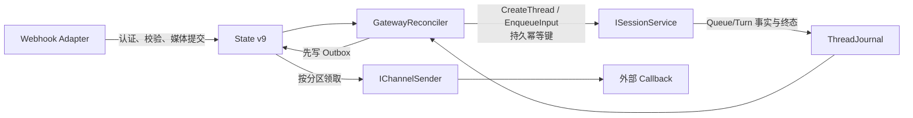

# OpenCoWork M10 Gateway and Operations 设计

## 文档状态

- 状态：已完成并归档；双平台发布目录验收通过
- 日期：2026-08-01
- 所属里程碑：OpenCoWork Runtime 1.0 / M10
- 对应计划：
  [M10 Gateway and Operations 实施计划](../plans/2026-08-01-open-cowork-m10-gateway-operations-implementation-plan.md)；
  本文与计划均不授权实现、外部监听、Secret 写入或真实渠道请求
- 对应归档：
  [M10 Gateway and Operations 交付归档](../archives/2026-08/2026-08-01-open-cowork-m10-gateway-operations-archives.md)
- 当前实现基线：State v9、OpenCoWork Wire 1.4、七个冻结生产程序集
- 当前平台结论：`win-x64`、`osx-arm64` 均为 Passed；M11 仍须重跑最终发布候选
- 继续工作前必须先阅读：
  - [OpenCoWork Runtime 1.0 路线规格](2026-07-25-open-cowork-runtime-1-0-roadmap.md)
  - [M0 Contract Freeze](2026-07-25-open-cowork-m0-contract-freeze-design.md)
  - [M0 能力台账](2026-07-25-open-cowork-m0-capability-ledger.md)
  - [M0-M11 验收目录](2026-07-25-open-cowork-m0-acceptance-catalog.md)
  - [M2 Durable Session Core 设计](2026-07-26-open-cowork-m2-durable-session-core-design.md)
  - [M5 Wire Alpha 设计](2026-07-28-open-cowork-m5-wire-alpha-design.md)
  - [M6 Capability Ecosystem 设计](2026-07-29-open-cowork-m6-capability-ecosystem-design.md)
  - [M8 Automations and Scheduler 设计](2026-07-30-open-cowork-m8-automations-scheduler-design.md)
  - [M9 DeepSeek Responses Provider 设计](2026-08-01-open-cowork-m9-deepseek-responses-provider-design.md)
  - [双平台真机发布验证台账](../../platform-release-validation-ledger.md)
  - `DotCraft_Core_核心代码详细设计与一比一复刻规范_v1.0.md`

本文细化 M0 已冻结的 `CAP-042`、`CAP-067..077` 与
`M9-ACC-001..010`。M10 是 OpenCoWork 1.0 最后一个功能 Slice；M11 只做契约、迁移、
安全、性能、安装和发布收口。因此本文不把新 Provider、UI、通用消息总线或安装发布
工作偷渡进 M10。

## 1. 目标、范围与成功标准

M10 让一个 Workspace 在无人守着终端时，通过受信任外部渠道接收任务、可靠提交给
唯一 `ISessionService`、可靠投递终态结果，并提供不依赖 UI 的运维查询。

包含：

- `gateway` 主宿主与内建 Webhook Channel；
- 测试使用的内存 Test Channel；
- 多 Channel 隔离、Inbound 去重、Conversation 到 Thread 映射；
- 单外部会话顺序、Outbound Outbox、Dead Letter 与崩溃恢复；
- 外部媒体的有界校验、内容寻址存储和路径保护；
- 用户级 Workspace Registry 与 Hub 查询；
- Usage 聚合、Tracing、Heartbeat、Dashboard 查询；
- `WorkspaceInsightService`、`InsightRun` 与 `ImprovementProposal`；
- State v9、OpenCoWork Wire 1.4、CLI 查询和双平台真实发布目录验收。

成功标准：

1. 同一 `(channelId, externalMessageId)` 无论并发、重放或重启，只提交一次 Session
   输入；相同 ID 不同正文稳定冲突；
2. 出站先写 Outbox，崩溃窗口不会静默丢失；远端可能重复收到同一 `deliveryId`，但
   OpenCoWork 不声称跨系统 Exactly Once；
3. 同一外部会话按持久 `partitionSequence` 有序，跨会话和跨 Channel 可并行；
4. 单个 Channel 的凭据、429、断连、毒消息或回调故障不拖垮其他 Channel；
5. Hub 从用户级注册表发现 Workspace，不读取当前工作目录来猜；
6. Gateway、Session、Provider、Tool、Automation、CoWork 与 Outbox 可通过安全
   `correlationId` 关联，日志和 Trace 不保存 Secret 或正文；
7. 所有后台循环都由现有 `WorkspaceRuntime` 模块生命周期启动、降级和逆序清理。

## 2. 明确不做

- 不增加第八个生产程序集；
- 不增加消息代理、第二个 SQLite、第二套 Session 状态机或通用工作流框架；
- 不实现 Slack、Teams、企业微信等厂商 SDK；1.0 只交付通用 Webhook 与 Test
  Channel；
- 不开放公网监听、内建 TLS、浏览器 Origin 或远程管理面；Webhook 固定监听
  loopback，公网暴露由用户控制的 TLS Reverse Proxy/Tunnel 负责；
- 不实现 Channel 配置热更新；有效配置在进程启动时冻结，修改后显式重启；
- 不让 Channel 直接解析或执行 Tool Call，也不绕过 `ISessionService`；
- 不把二进制媒体直接送入 M9 的文本型 DeepSeek Responses 请求；M10 只保证安全
  接收、保存、引用和查询，后续多模态 Provider 激活需独立设计与真实验证；
- 不交付桌面/Web Dashboard；`Dashboard` 只是一组只读聚合查询；
- 不让 Workspace Insights 自动改代码、配置、Trust、Channel 或运行状态；
- 不在 M10 承担安装、升级、签名、公证、SBOM 或最终发布候选验收，这些属于 M11。

## 3. 推荐架构与职责归属

M10 继续使用七程序集，不改变 M0 依赖方向：

| 程序集 | M10 职责 |
| --- | --- |
| `OpenCoWork.Abstractions` | Channel、Operations、Hub、Trace、Usage、Heartbeat、Insight 稳定契约；State v9 Migration Contributor 契约保持不变 |
| `OpenCoWork.Core` | `GatewayService`、`GatewayReconciler`、State v9、媒体存储、Outbox、Usage/Trace/Heartbeat/Insight 查询与用户级 Workspace Registry |
| `OpenCoWork.Protocol` | loopback Kestrel Webhook Adapter、Wire 1.4 DTO 映射与通知；只调用 Abstractions 服务 |
| `OpenCoWork.App` | `gateway` 主宿主、CLI 组合、模块注册和 Secret 命令入口 |
| `OpenCoWork.Automations` | 不新增 M10 状态；只补 Activity/Correlation 观测点 |
| `OpenCoWork.Teams` | 不新增 M10 状态；只补 Activity/Correlation 观测点 |
| `OpenCoWork.Generators` | 继续生成模块、配置和 Wire Catalog，不增加运行时扫描 |

核心契约：

- `IChannelService`：持久化入站、查询 Channel/Inbox/Outbox、重试 Dead Letter；
- `IChannelSender`：由 Protocol 的 Webhook Adapter 实现，Core 只提交已冻结的出站
  Envelope；
- `IOperationsQueryService`：Usage、Trace、Heartbeat、Insight 与 Dashboard 查询；
- `IHubRegistry`：用户级 Workspace 注册、列表和只读跨 Workspace 查询；
- `GatewayService`：唯一 Gateway 领域入口；
- `GatewayReconciler`：唯一消息恢复循环，不再增加 Scheduler 或 Intent Framework；
- `OperationsRuntime`：管理 Trace Collector、Heartbeat 和 Insight 周期，不注册独立
  `IHostedService`。

Test Channel 是测试实现，不进入生产 Catalog。`IChannelSender` 有 Webhook 与 Test 两个
实际消费者，因此不是为未来预留的单实现接口。

### 3.1 主宿主与模块

新增稳定模块 ID `gateway`：

- `Dependencies = ["session"]`；
- `CanBePrimaryHost = true`；
- 由 `opencowork gateway` 显式选择，不依赖优先级猜测；
- Module 在所有 Host 中注册 State/Query 契约，但只有主宿主为 `gateway` 时启动
  Webhook Intake 与 Outbox 发送；
- `app-server` 启动 Wire 1.4 查询、Trace Collector、Heartbeat 与 Insight 周期，但不
  监听外部 Webhook；
- `cli`、`acp` 只使用按命令创建的只读查询，不启动长期 Channel 循环。

现有 `ModuleLifecycleCoordinator` 仍是唯一生命周期协调器。M10 不注册第二个
`IHostedService`，也不把 Kestrel 偷挂为无法统一停止的后台 Host。

## 4. Channel 配置、信任与 Secret

新增 `[ConfigSection("gateway")] GatewayConfig`，只保留确实需要调节的字段：

```jsonc
{
  "gateway": {
    "listenPort": 9200,
    "channels": [
      {
        "id": "build-bot",
        "kind": "webhook",
        "enabled": true,
        "callbackUrl": "https://example.invalid/opencowork/result",
        "credential": {
          "source": "osSecretStore"
        },
        "maxConcurrentSends": 4,
        "minimumSendIntervalMs": 0
      }
    ]
  }
}
```

规则：

- `listenPort` 为 `1..65535`；监听地址固定 loopback，不提供 Host 配置；
- Channel ID 使用 lower kebab-case，长度 `1..64`，工作区内唯一；
- M10 产品配置只接受 `kind=webhook`；未知 Kind 在任何网络操作前失败；
- `callbackUrl` 必须是绝对 HTTPS URL，不跟随 Redirect；测试通过构造注入 loopback
  HTTP，不开放产品配置例外；
- `credential.source` 只允许 `environment` 或 `osSecretStore`；Environment 模式必须
  指定变量名，OS Store Account 由规范化 Workspace Hash 与 Channel ID 派生；
- `maxConcurrentSends` 为 `1..16`，默认 4；同一 Conversation 仍固定串行；
- `minimumSendIntervalMs` 为 `0..60000`，用于真实渠道速率校准；
- 配置正文、Callback URL、Secret 引用、发送上限和间隔进入 canonical SHA-256；
  Secret 值不进入配置摘要、SQLite、日志、Trace 或 Wire；
- 配置快照启动后不可变，修改只影响下次进程启动。

新增 `CapabilityTrustScope.ExternalChannel`。Channel 不进入 M6 的通用
`CapabilityKind` Catalog，避免 Wire 1.1–1.3 客户端突然看到新 Kind；它只在 Wire
1.4 `channel/*` 投影。每个 Channel 以自己的 Source Descriptor、配置摘要和 Trust
决定激活：

```text
Config enabled
∩ Workspace Trust allows ExternalChannel
∩ Credential available
= Channel Ready
```

未授信为 `pendingTrust`，缺 Secret 为 `unavailable`，配置错误为 `faulted`，均不得
打开入站路由或发起出站请求。Channel 配置/摘要变化必须重新授信。

现有 Provider 专用 OS Secret Store 原语在实现时下沉为 Core 内部通用
`IOsSecretStore`，Provider 与 Channel 共同复用；不得复制一套 Keychain/Credential
Manager 进程调用。Secret 取用期间动态注册到 `SecretRedactor`，Channel 停止后释放
Lease。M10 Wire 不返回 Secret，也不提供读回方法；设置/清除只通过本机 CLI 的
`channel secret set|clear`。

## 5. Webhook v1 公开契约

### 5.1 监听与认证

生产监听固定为：

```text
POST http://127.0.0.1:{listenPort}/channels/{channelId}/messages
```

用户若需公网接入，必须由受控 Reverse Proxy/Tunnel 终止 TLS，再转发到 loopback。
OpenCoWork 不信任 Proxy 注入的远端路径、文件名或 Trace Context。

请求头：

```text
Content-Type: application/json
X-OpenCoWork-Timestamp: <Unix seconds>
X-OpenCoWork-Signature: v1=<lowercase hex HMAC-SHA256>
```

签名输入精确为：

```text
ASCII(timestamp) + "." + rawRequestBodyBytes
```

校验顺序固定为 Body 长度、Timestamp 格式与五分钟窗口、Channel Ready、Secret
获取、HMAC 固定时间比较、JSON 解析、Schema、媒体，最后才持久化。认证失败统一 401，
不暴露 Channel 是否存在、Secret 来源或摘要。

### 5.2 Inbound Envelope

```json
{
  "schemaVersion": 1,
  "messageId": "external-opaque-id",
  "conversationId": "external-conversation-id",
  "sentAtUtc": "2026-08-01T00:00:00Z",
  "text": "task text",
  "attachments": [
    {
      "mediaType": "image/png",
      "displayName": "screenshot.png",
      "contentBase64": "..."
    }
  ]
}
```

固定限制：

- Raw Request Body 最大 24 MiB；
- `messageId`、`conversationId` 为 `1..256` 个无控制字符的 Unicode 字符；
- Text UTF-8 最大 256 KiB；Text 与 Attachments 至少一个非空；
- 最多 8 个 Attachment，单个解码后最大 8 MiB，总解码大小最大 16 MiB；
- 每个 Channel 最多同时处理 16 个已认证入站请求，容量满返回 429，不占用其他
  Channel 的入口容量；
- M10 允许 `text/plain`、`application/pdf`、`image/png`、`image/jpeg`、
  `image/gif`、`image/webp`；类型必须同时通过声明值和 BCL 可实现的魔数/UTF-8
  校验；
- 未知字段、重复 JSON 属性、非法 Base64、类型不符和超限请求严格失败。

服务端只有在消息与媒体元数据已提交 State v9 后返回 202。响应只包含内部
`receiptId`、`correlationId` 和 `duplicate`；不返回 Thread/Turn、绝对路径或
Secret。相同 Message ID 与相同规范 Body SHA-256 返回原 Receipt；相同 ID 不同
Body 返回 409。

### 5.3 Outbound Envelope

M10 Webhook 只发送一个 Turn 终态结果，不通过外部渠道解析 Approval 或 UserInput。
等待交互的 Turn 继续由 Wire 客户端处理；终态后再创建 Outbox。

```json
{
  "schemaVersion": 1,
  "deliveryId": "uuidv7",
  "sourceMessageId": "external-opaque-id",
  "conversationId": "external-conversation-id",
  "threadId": "uuidv7",
  "turnId": "uuidv7",
  "status": "completed",
  "text": "bounded terminal text",
  "errorCode": null,
  "correlationId": "uuidv7",
  "createdAtUtc": "2026-08-01T00:00:00Z"
}
```

Outbound 使用同一 HMAC 线格式签名，正文最大 256 KiB，正文过大使用现有结果限制
策略截断并明确 `truncated=true`，不发送内部文件路径。远端必须按 `deliveryId` 去重；
OpenCoWork 重试始终复用同一 Delivery ID 和相同 Body SHA-256。

HTTP `2xx` 为成功；`408`、`425`、`429`、`5xx` 和网络/超时为可重试；其他 `4xx`
直接 Dead Letter。有效 `Retry-After` 只暂停当前 Channel，且上限十分钟。禁用 Redirect，
DNS、连接和响应 Body 均有界。

## 6. 媒体存储与安全

内容保存到：

```text
.opencowork/runtime/external-channel-media/
└── {channelId}/{sha256[0..2]}/{sha256}
```

规则：

1. 远端 `displayName` 只作为展示元数据，不参与路径；
2. 内容在受控临时文件中流式 Base64 解码、计数和 SHA-256，再以同目录原子重命名
   提交；
3. 每次目录创建、打开和提交都执行规范化、包含性、Symlink/Junction/Reparse Point
   检查；
4. SQLite 只保存相对路径、Media Type、大小、摘要和展示名；
5. 已存在相同 SHA-256 的文件必须复验大小和摘要，不按最后写入覆盖；
6. 文件已提交但数据库事务未提交时，只形成无引用内部孤儿；Reconciler 只能清理超过
   一小时且 State v9 无引用的孤儿，不能自动删除已登记媒体；
7. 媒体内容不进入日志、Trace、Dashboard、默认 Inbox 列表或 Provider 请求；
8. M10 不实现自动 Retention 删除用户消息或已登记媒体。

`channel/inbound/list` 只返回媒体 ID、类型、大小和摘要。读取媒体需要本地 Workspace
Authority 的显式 `channel/media/read`，按 Media ID、Offset、Length 分块读取；单块
上限 256 KiB，响应返回 `nextOffset` 与 EOF，始终低于 Wire 1 MiB Message 上限，且不
接受调用方路径。

## 7. 可靠消息模型



### 7.1 Inbound 状态

```text
pending
  → dispatching
  → delivered
  ↘ failed → dispatching
           ↘ deadLettered
```

- `pending`：已持久化，尚未交给 Session；
- `dispatching`：持有有期限 Lease，正在确保 Thread 或提交 Queue Item；
- `delivered`：Session 已提交 Queue Item；不表示 Turn 已完成；
- `failed`：可重试故障，保存下次尝试时间和稳定错误码；
- `deadLettered`：固定五次基础设施尝试耗尽或非重试错误。

每条入站记录在首次事务中冻结：

- 内部 Inbound ID、`correlationId`；
- Channel、External Message/Conversation ID、Body SHA-256；
- `partitionSequence`；
- Thread Create 与 Turn Enqueue 两个 UUIDv7 Idempotency Key；
- 有界规范 Payload 与媒体引用。

### 7.2 Conversation 到 Thread

`(channelId, conversationId)` 唯一映射到一个活动 Thread。映射行先以
`threadId = null` 和已冻结 Create Idempotency Key 提交，再调用
`ISessionService.CreateThreadAsync`。若进程在 Thread 已创建、映射尚未回填时崩溃，
重试同一 Idempotency Key 必须由 Session Receipt 返回同一 Thread。

Channel Thread 使用普通 Project Execution Workspace，不增加平行 Thread 类型。
映射表是 Gateway 权威关系；M10 不给 `ThreadSnapshot` 再堆第三个可空 Provenance。
Thread 被用户删除时映射变为未绑定，下一条消息用新的持久 Idempotency Key 创建新
Thread；历史入站记录仍保留原 Thread/Turn ID 证据。

### 7.3 单会话顺序与 Session 提交

同一 Channel/Conversation 只领取最小非终态 `partitionSequence`。不同 Conversation
和不同 Channel 可以并行。

Gateway 调用现有 `EnqueueInputAsync(..., QueueIfBusy)`，不等待模型完成。提交文本由
固定 Header、原始 Text 和媒体 ID/类型/摘要引用组成；不会把远端文件名当路径，也
不会把二进制展开进 Prompt。

`EnqueueInputRequest` 与 `QueuedTurnInputSnapshot` 增加可空 `CorrelationId`。Gateway
传内部 UUIDv7；普通 CLI/Wire 调用为空时由 Session 生成。该值进入 Queue Journal
事实、`turns` 投影和结构化日志，但不进入模型文本，也不投影到 Wire 1.0–1.3 的
Queue DTO。旧 Journal 缺失该可选字段时按 null 读取，不修改既有提交点。

Gateway 保存 Queue Item ID；通过 Session Event 将它关联到 Turn ID。若通知丢失，
Reconciler 从 Journal/Session 查询恢复。Queue Item 被外部管理操作删除时，入站进入
`deadLettered(channel.turnRemoved)`，不得永久卡住分区。

### 7.4 Outbox 状态

```text
pending
  → sending
  → sent
  ↘ failed → sending
           ↘ deadLettered
```

Turn 终态只负责生成确定性 Outbox Body，并在单个 SQLite 事务中提交。HTTP 发送永远
发生在事务外。`sending` 使用两分钟 Lease、三十秒续租；进程崩溃后由 Reconciler
回收过期 Lease。

固定退避为 1 秒、5 秒、30 秒、2 分钟、10 分钟；`Retry-After` 可延后但不能超过
十分钟。第五次失败进入 Dead Letter。崩溃发生在远端已接收、`sent` 未提交的窗口时，
OpenCoWork 重发相同 Delivery ID；这是至少一次语义，不得伪装 Exactly Once。

同一 Conversation 的 Outbox 按入站 `partitionSequence` 发送；前项 `sent` 或
`deadLettered` 后才发送下一项。Dead Letter 会阻断当前分区直到被明确判定终态，但不
阻断其他分区；进入 Dead Letter 后后续项可继续。

### 7.5 手动重试

`channel/deadLetter/retry` 只接受 Inbound 或 Outbox ID、Expected Revision 与 UUIDv7
Idempotency Key：

- Inbound 重试复用原 Session Idempotency Key；
- Outbox 重试复用原 Delivery ID 与 Body SHA-256；
- Payload、目标 URL、凭据引用或媒体不能在重试时改写；
- 若操作者要改变正文或目标，必须产生新的外部 Message，而不是篡改历史。

## 8. State v9

M10 通过现有 `IWorkspaceStateMigrationContributor` 把唯一数据库从 v8 升到 v9。
迁移仍由 Core 统一备份、事务提交、结构校验和失败恢复；不得由 Gateway 自行执行 DDL。

State v9 新增十张表：

| 表 | 权威职责 |
| --- | --- |
| `operations_state` | 单例 Workspace UUIDv7、全局 Revision 与更新时间 |
| `channels` | 冻结配置摘要、Trust/Runtime 状态、Revision 与脱敏诊断 |
| `channel_thread_mappings` | Channel/Conversation 到当前 Thread 的映射与 Create Idempotency Key |
| `channel_inbound_messages` | 去重、分区序号、Payload、Session Idempotency、Lease 与入站状态 |
| `channel_media` | 媒体相对路径、类型、大小、SHA-256 与展示名 |
| `channel_outbox` | 冻结 Envelope、Delivery ID、分区序号、Lease、重试与 Dead Letter |
| `workspace_heartbeat` | 当前 Runtime Instance、健康快照、Observed/Expires/Stopped 时间 |
| `trace_spans` | 有界安全 Span、Correlation 与实体 ID 投影 |
| `insight_runs` | 洞察水位、触发、状态和脱敏诊断 |
| `improvement_proposals` | 去重指纹、类型、严重度、摘要、证据引用和审阅状态 |

State v9 还为既有 `turns`、`automation_runs`、`agent_runs` 增加可空且格式受约束的
`correlation_id`。Core、Automations、Teams 各自的 v9 Migration Contributor 只修改
自己拥有的表；Core Gateway Contributor 不直接假设或改写其他程序集私有表。旧记录为
null，不伪造历史关联。

关键约束：

- `(channel_id, external_message_id)` 唯一；
- `(channel_id, external_conversation_id)` 映射唯一；
- `(channel_id, external_conversation_id, partition_sequence)` 对 Inbound/Outbox 唯一；
- `delivery_id`、两个 Session Idempotency Key、Workspace/Run/Proposal ID 均为小写
  UUIDv7；
- Payload、Evidence 与 Trace Tags 必须是有效、有界 JSON；
- Media SHA-256 为 64 位小写十六进制；相对路径不得含 `..` 或绝对根；
- Channel/Conversation 分区的可领取索引必须以状态、下次尝试、Lease 到期和序号为
  前缀；
- 所有命令使用 `BEGIN IMMEDIATE` 所在的现有 `StateWriteCoordinator`，不另建全局锁；
- State v9 Contributor 必须逐表、逐索引、逐列、逐外键与 `PRAGMA integrity_check`
  验证；
- v8 到 v9 迁移失败继续使用现有 Backup/Restore，不发布半迁移能力。

Usage 不新建重复表。Provider Usage 继续以 ThreadJournal 事实为权威、现有
`provider_usage` 为可重建投影；Channel 聚合通过 Thread/Turn 与 Gateway 映射关联。
Dashboard 也只查询现有权威表，不建立 `dashboard_usage_records` 副本。

## 9. GatewayReconciler

M10 只增加一个消息 Reconciler。每轮顺序固定为：

1. 回收本实例遗留或过期的 Inbound/Outbox Lease；
2. 恢复未绑定 Conversation 的 Thread Create；
3. 按分区领取并提交 Inbound Queue Item；
4. 从 Session 事实恢复 Queue Item 到 Turn 的映射；
5. 为已终结 Turn 幂等创建 Outbox；
6. 按 Channel/Conversation 顺序领取并发送 Outbox；
7. 清理超过一小时且数据库无引用的媒体孤儿；
8. 发布一次聚合 Revision/Changed 通知。

数据库事务内只 Claim、CAS 和提交状态；Thread/Session、文件与 HTTP 副作用都在锁外。
所有外部副作用之前都有持久 Idempotency/Delivery ID，之后都有可探测结果。Reconciler
事件唤醒与固定短周期兜底并存；事件可丢，SQLite 状态不能丢。

单个实体故障只推进该实体。只有 State v9 不可用、Reconciler 循环死亡或全部 Sender
无法安全工作时，Gateway 模块才调用 `ReportDegraded("gateway", reason)` 并停止新
Intake/Claim。恢复必须先完成 State 校验和一轮 Reconcile，再 `ClearDegraded`。

## 10. Usage、Tracing 与 Correlation

### 10.1 Correlation

Gateway 为每个首次接收的 Inbound 生成内部 UUIDv7 `correlationId`。外部
`messageId`、远端 `traceparent` 或文件名不能充当内部 Correlation。

所有边界使用同一个安全 Correlation Tag：

```text
gateway.receive
→ gateway.dispatch
→ session.turn
→ provider.responses / tool.invoke
→ automation.run / cowork.agentRun（若被当前 Turn 触发）
→ gateway.outbox.send
```

Session Queue Journal 持久化 Correlation，使排队和重启后仍可关联。结构化日志使用
`BeginScope` 注入 `workspaceId`、`correlationId`、安全实体 ID 与稳定错误码；不记录
Text、Prompt、Tool Arguments、Callback URL、绝对路径或 Secret。

### 10.2 Trace

Tracing 使用 BCL `System.Diagnostics.ActivitySource`、W3C Trace ID 和一个进程内
`ActivityListener`，不增加 OpenTelemetry Package 或通用遥测框架。完成 Span 经有界
Channel 批量写入 `trace_spans`。

持久字段只包括：Trace/Span/Parent ID、Correlation ID、稳定 Span Name、Kind、Status、
开始/结束/耗时、安全实体 ID、稳定错误码和安全 Tag JSON。正文、Headers、Prompt、
模型输出、Tool Arguments、Secret、URL Query、环境变量和 Stack Trace禁止持久化。

Trace 是观测投影，不能阻塞业务提交。有界队列满时丢 Span、增加 Dropped Counter 并
让 Heartbeat 进入 `degraded`；不得反压 Inbound、Session 或 Outbox。正常固定负载下的
验收必须零丢失。

### 10.3 Usage

`usage/query` 从已提交 `provider_usage` 聚合：

- Prompt、Cached Prompt、Completion、Reasoning 与 Total Tokens；
- Provider/Model、Purpose、Thread、Channel 与 UTC 时间桶；
- `provider` 与 `localEstimate` 分开，不能混算成真实计费；
- 不在无官方价格契约时计算或展示货币成本；
- 删除 Thread 后其 Journal/Usage 投影按既有删除语义消失，不保留影子账本。

## 11. Heartbeat 与 Dashboard

Heartbeat 是健康快照，不是 Agent 输入或“业务成功”信号。只有 `app-server` 和
`gateway` 长期 Host 启动周期；固定 30 秒观测一次，90 秒未刷新由查询端计算为
`stale`。

快照包含：

- Runtime Instance ID、Primary Host、WorkspaceRuntime Status；
- Session Projection、Capability、Automation、CoWork、Gateway 模块状态；
- Ready/Faulted Channel 数、Pending/Failed/Dead Letter 数；
- Reconciler 最近成功时间、Trace Dropped Count、SQLite 可读写检查；
- Observed、Expires、Stopped UTC。

状态为 `healthy`、`degraded`、`unhealthy`、`stopping`、`stopped`；`stale` 只由读取时
计算。Heartbeat 只说明控制面健康，不能因为 Timer 正常就把失败 Turn、Dead Letter 或
丢失 Sender 记为成功。

`hub/dashboard/get` 是只读聚合：Heartbeat、Channel/Outbox 计数、最近 24 小时 Usage、
Trace Error 数和未归档 Proposal 数。它不保存第二份 Dashboard 状态，也不启动 UI。

## 12. Hub 与用户级 Workspace Registry

用户级注册表固定为：

```text
~/.opencowork/workspaces.json
```

Schema v1 每项保存 Workspace UUIDv7、规范化绝对路径、Data Root、Display Name、
Registered/LastSeen UTC。写入使用用户级锁文件、同目录临时文件、Flush 和原子替换；
拒绝 Symlink/Reparse Point。Registry 不是 Workspace 状态权威，只负责发现。

`opencowork init`、成功启动的 `app-server` 和 `gateway` 原子 Upsert；普通只读查询不
改 LastSeen。路径移动后，相同 `operations_state.workspace_id` 更新既有记录。路径
缺失只标记 `missing`，不得自动删除用户登记。

Hub 查询：

- 不调用 `WorkspaceDiscovery`；
- 不读取进程 CWD 下的 `.opencowork`；
- 先按 Workspace ID 解析 Registry，再以登记 Data Root 打开只读 SQLite；
- 不创建 `WorkspaceRuntime`、Session、Provider、Tool、Channel 或后台线程；
- 单个 Workspace 缺失、忙碌或损坏只返回该项诊断，不阻止其他 Workspace。

Workspace 绝对路径只对本机 User Authority 的 CLI/Wire 返回，不写日志或 Trace。

## 13. Workspace Insights

M10 的 `WorkspaceInsightService` 采用确定性运维信号分析，不启动隐藏 Agent、隐藏
Thread 或额外模型消费。这是 1.0 的最小安全实现；模型撰写洞察属于 1.x，除非另行
冻结 Provider、成本、Prompt Injection 和只读工具边界。

固定信号：

- 同一 Channel/错误码重复 Dead Letter；
- Outbox 长期堆积或 Sender 连续不可用；
- Trace 中相同稳定错误码重复出现；
- Heartbeat 持续 Degraded/Unhealthy 或 Trace Drop；
- Provider Usage 在短时间窗口显著集中，但不推断货币成本。

一次 `InsightRun` 冻结输入水位、规则版本和安全计数，输出零个或多个
`ImprovementProposal`。Proposal 只含 Kind、Severity、Title、Summary、稳定实体 ID/
计数证据、Fingerprint 与状态；不复制消息正文、Prompt、模型输出、路径或 Secret。

相同 Fingerprint 的 Active Proposal 只更新最近观测时间和计数，不重复制造建议。
Proposal 只允许 `active → archived`；没有 Apply、AutoApply、Patch、Shell 或 Config
Mutation。周期固定 24 小时且只有新证据时运行；`insight/run` 可显式触发同一分析。

## 14. OpenCoWork Wire 1.4

M10 增量版本为 Wire 1.4：

- 1.0、1.1、1.2、1.3 的方法、错误和通知保持不变；
- 旧客户端看不到 1.4 方法、DTO 字段和通知；
- ACP v1 不增加 Channel/Hub/Operations 映射；
- `LatestVersion = "1.4"`，只有对应服务可用时才能协商 1.4；
- `hub/*` 使用新增 `user` Authority，其余 M10 方法使用 Workspace Authority；
- Query 不要求 Idempotency，Mutation 必须 UUIDv7 Idempotency Key；
- List 使用查询形状绑定的 Keyset Cursor，非法或跨查询复用返回稳定错误。

### 14.1 方法

| 方法 | 方向 | Mutates | Idempotency | 说明 |
| --- | --- | :---: | --- | --- |
| `channel/list` | C→S | No | none | 脱敏 Channel 状态分页 |
| `channel/get` | C→S | No | none | 单 Channel 状态与安全配置摘要 |
| `channel/inbound/list` | C→S | No | none | Inbound 状态、媒体元数据，不返回正文 |
| `channel/outbox/list` | C→S | No | none | Outbox/Dead Letter 元数据，不返回 Secret |
| `channel/media/read` | C→S | No | none | 按 Media ID/Offset 分块读取，单块最多 256 KiB |
| `channel/deadLetter/retry` | C→S | Yes | required | 原记录、原 Payload/Delivery ID 重试 |
| `hub/workspace/list` | C→S | No | none | 用户级 Registry 分页 |
| `hub/workspace/get` | C→S | No | none | Workspace 注册与在线状态 |
| `hub/dashboard/get` | C→S | No | none | 只读运维聚合 |
| `usage/query` | C→S | No | none | Token 聚合 |
| `trace/list` | C→S | No | none | Trace 摘要分页 |
| `trace/get` | C→S | No | none | 单 Trace 的安全 Span |
| `heartbeat/get` | C→S | No | none | 当前或指定注册 Workspace 健康快照 |
| `insight/run` | C→S | Yes | required | 显式运行确定性分析 |
| `insight/list` | C→S | No | none | Run/Proposal 只读分页 |
| `insight/get` | C→S | No | none | Proposal 与安全证据 |
| `insight/archive` | C→S | Yes | required | Expected Revision 归档 |

通知：

- `channel/changed`；
- `heartbeat/changed`；
- `insight/changed`。

Usage 与 Trace 不逐条推送，避免高频通知和慢客户端反压。客户端通过 Revision/水位
查询。Wire Projection 不返回 Credential Source Name、Callback URL、Inbound/Outbox
正文、绝对媒体路径或 Trace 原始 Tags。

### 14.2 CLI

最小 CLI 面：

```text
opencowork gateway --workspace <path> [--port <port>]
opencowork channel list|inbound|outbox|retry|secret
opencowork hub list|dashboard
opencowork ops usage|trace|heartbeat|insight
```

Query 命令统一支持 `--json`；Secret Set 从安全交互输入读取，不接受命令行明文参数，
避免 Shell History/Process List 泄漏。CLI 与 Wire 调用同一服务，不复制业务规则。

## 15. 模块生命周期

### 15.1 Start

`gateway` 主宿主启动顺序：

1. Session/Capability Runtime 已完成恢复；
2. Core 备份、迁移并验证 State v9；
3. 加载冻结 Gateway Config、Trust 和每 Channel Secret Lease；
4. 建立 Channel 状态投影与媒体目录安全基线；
5. 启动 Trace Collector、Heartbeat、Insight 周期；
6. GatewayReconciler 完成首轮 Lease/Inbound/Outbox 收敛；
7. 启动 loopback Webhook Intake；
8. 发布 Channel Binding 与 Wire 1.4 可用性。

State v9、路径、Reconciler 或监听端口无法建立安全基线时启动失败，交给现有 Host 做
逆序回滚。单个 Channel 配置、Trust、Secret 或 Callback 故障只隔离该 Channel。

### 15.2 Stop

顺序固定为：

1. Wire/Channel Binding 标为不可用；
2. 停止接受新 HTTP 请求并等待当前持久化临界区退出；
3. 停止领取 Inbound/Outbox，新发送使用统一 Stop Timeout；
4. 等待 Reconciler 临界区退出并释放本实例 Lease；
5. 写入 `workspace_heartbeat=stopping/stopped`；
6. 停止 Insight 与 Heartbeat 周期；
7. Flush Trace Batch，注销 ActivityListener；
8. 释放所有 Channel Secret Lease、HttpClient 和 Kestrel 资源。

正常 Stop 不把 Pending/Failed 记录改成 Dead Letter，也不把 Running Turn 改成失败。
重启后从 SQLite、Journal 与 Session 状态继续收敛。任一步 Stop 失败不能跳过后续清理，
继续由 `ModuleLifecycleCoordinator` 聚合错误。

## 16. 稳定错误契约

M10 继续复用现有 JSON-RPC 数字分类，不增加数字错误类别：

| JSON-RPC | 稳定错误示例 |
| ---: | --- |
| `-32000` Business | `channel.permissionDenied`、`channel.authenticationFailed`、`channel.mediaRejected` |
| `-32001` Conflict | `channel.idempotencyConflict`、`channel.revisionConflict`、`insight.revisionConflict` |
| `-32002` Not Found | `channel.notFound`、`channel.mediaNotFound`、`hub.workspaceNotFound`、`trace.notFound`、`insight.notFound` |
| `-32003` Invalid State | `channel.invalidState`、`channel.invalidCursor`、`channel.turnRemoved`、`hub.registryInvalid` |
| `-32004` Unavailable | `channel.unavailable`、`channel.rateLimited`、`gateway.unavailable`、`trace.unavailable`、`heartbeat.unavailable` |
| `-32005` Cancelled | 只表示当前 RPC 被取消，不改变持久实体终态 |

Webhook HTTP 映射：

- 400：Schema/字段/签名格式错误；
- 401：认证失败；
- 409：Message ID 与 Body 摘要冲突；
- 413：Raw/解码内容超限；
- 415：Media Type 不支持或魔数不符；
- 429：当前 Channel 入站容量已满；
- 503：Gateway/State/Reconciler 不可安全接受新消息；
- 202：消息已持久化或相同摘要的重复消息。

所有错误消息先过 `SecretRedactor`；第三方 Body、Header、Exception、Stack Trace、URL、
绝对路径和 OS Secret Store 诊断不得穿透到 HTTP、Wire、Journal 或默认日志。

## 17. 验收映射

| 验收编号 | 设计证据入口 |
| --- | --- |
| `M9-ACC-001` | 每 Channel Config/Trust/Secret Lease/Sender/限流与独立状态；多分区并发 |
| `M9-ACC-002` | Inbound 唯一键、Body 摘要冲突、先 State v9 后 Session、持久 Idempotency Key |
| `M9-ACC-003` | Turn 终态先写 Outbox、Sending Lease、同 Delivery ID 崩溃重试 |
| `M9-ACC-004` | 持久 Partition Sequence、同会话串行、跨会话并行、Dead Letter 终态 |
| `M9-ACC-005` | 有界媒体、类型/魔数/摘要、内容寻址、路径包含和 Symlink/Reparse Corpus |
| `M9-ACC-006` | `operations_state.workspace_id`、用户 Registry、不同 CWD 的 Hub 只读查询 |
| `M9-ACC-007` | Gateway Module Start/Stop、Kestrel/HttpClient/Lease/Secret/Timer 完整回收 |
| `M9-ACC-008` | Wire/CLI Usage、Trace、Heartbeat、Insight 与 `hub/dashboard/get`，无 UI |
| `M9-ACC-009` | Heartbeat 与全部后台循环进入 WorkspaceRuntime 生命周期及 Stop Timeout |
| `M9-ACC-010` | 持久 Correlation、ActivitySource、结构化日志 Scope、Usage Join 与 Secret 扫描 |

### 17.1 确定性测试与故障注入

最小自动化证据：

- 相同/冲突 Message ID 的顺序、并发、重启重放；
- Thread Create、Queue Commit、Turn 映射、Outbox Insert、HTTP 发送、Sent Commit
  前后逐窗口崩溃；
- 一个 Conversation 100 条有序、32 Conversation 并行、跨 Channel 429/断连隔离；
- Poison Inbound/Outbox 五次进入 Dead Letter，其他分区继续；
- HMAC 时间窗、固定时间比较、Body 上限、重复属性和未知字段；
- 恶意文件名、绝对路径、`..`、Symlink、Junction/Reparse Point、类型伪造、摘要
  篡改、Base64 Bomb 与孤儿恢复；
- Registry 原子写、并发 Upsert、不同 CWD、缺失 Workspace 与损坏单项隔离；
- Trace Queue 饱和、Dropped Heartbeat、跨 Gateway/Session/Provider/Tool Correlation；
- Provider Usage 的 Channel/Model/时间桶对账，不混淆 Estimate；
- Insight Fingerprint 去重、只读规则、Archive Revision 和“无自动 Apply”；
- Wire 1.0–1.3 全回归、1.4 版本隐藏、Cursor、Revision、Idempotency 与通知。

故障注入继续使用内部构造参数 `Action<FaultPoint>`，不增加生产配置、环境变量或通用
Chaos Framework。

### 17.2 固定负载与双平台

固定负载：

- 8 个 Channel，每个 32 个 Conversation、每 Conversation 100 条消息；
- 10,000 条混合 Inbound/Outbox，10% 可重试失败、1% Dead Letter；
- 100,000 个 Trace Span、10,000 条 Usage、1,000 个 Proposal 历史分页；
- 每页 100 条完成 Keyset 全遍历，无重复、无遗漏。

记录 Intake、Dispatch、Outbox Lag、Reconcile、SQLite Busy、Trace Drop、内存、句柄和
子进程，不在 M10 仅凭单机样本设置对外延迟 SLA；M11 结合两平台发布候选确定发布
预算。

`win-x64` 与 `osx-arm64` 都必须从各自发布目录真实运行 App/TestClient：

1. Gateway loopback Webhook、HMAC、Reverse Proxy 模拟与多 Channel 隔离；
2. 强杀恢复、Outbox 重发、同 Delivery ID 和 Dead Letter；
3. macOS Symlink 与 Windows Junction/Reparse Point 媒体 Corpus；
4. Keychain/Credential Manager Channel Secret Set/Use/Clear；
5. Hub 在不同 CWD 下发现同一 Workspace；
6. Wire 1.0–1.3 回归与 Wire 1.4 Operations 场景；
7. Secret Canary 覆盖 HTTP、State、Journal、Trace、日志、Wire、stdout/stderr；
8. Stop/强杀后 Kestrel、HttpClient、Timer、Lease、文件句柄和子进程残留检查。

交叉发布只证明产物可生成。两端结果统一回填
`docs/platform-release-validation-ledger.md`，M10 未取得两端 Passed 前不得标记 Done，
更不能替代 M11 最终发布候选复验。

## 18. 后续 Outcome 与变更控制

后续实施计划建议保持十个可独立验收 Outcome：

| Outcome | 独立交付边界 |
| ---: | --- |
| 1 | M10 契约、Config、Trust/Secret 复用、Gateway 主宿主与架构门禁 |
| 2 | State v9 十表、迁移完整性、Operations Workspace ID 与路径 |
| 3 | Webhook HMAC、严格 Envelope、媒体存储和安全 Corpus |
| 4 | Inbound 去重、Conversation/Thread 映射、Session 幂等提交与顺序 |
| 5 | Outbox、Sender 隔离、Lease/重试/Dead Letter 与崩溃恢复 |
| 6 | Usage、ActivitySource Trace、持久 Correlation 与结构化日志 |
| 7 | Heartbeat、Hub Registry、Dashboard 与 Workspace Insights |
| 8 | Wire 1.4 全方法、错误、通知、CLI 与版本隐藏 |
| 9 | 故障、安全、固定负载和全量回归 |
| 10 | 双 RID 发布、两平台真机、台账与交付归档 |

以下变化必须先回到设计确认，不能由实施计划自行扩大：

- 增加生产程序集、Channel 厂商 SDK、远程监听/TLS 或消息代理；
- 改变至少一次投递、Inbound 先持久化、Outbox 先提交或单会话顺序；
- 让 Channel 绕过 Session Core、让 Insights 调模型或自动修改 Workspace；
- 把二进制媒体送入 Provider、增加多模态模型声明；
- 改变 State v9 权威表、Wire 1.4 公共方法/幂等或用户级 Hub Authority；
- 把 M11 发布收口工作提前塞进 M10。

本文已于 2026-08-01 经用户确认并进入 `Design Freeze`。设计确认与实施计划仍不授权
实现、外部监听、Secret 写入或真实 Webhook 请求。
